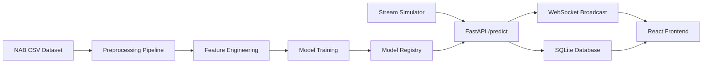

<div align="center">
  <p>
    <a href="https://www.python.org/"></a>
    <a href="https://fastapi.tiangolo.com/"></a>
    <a href="https://reactjs.org/"></a>
    <a href="https://www.docker.com/"></a>
    <a href="https://scikit-learn.org/"></a>
    <a href="LICENSE"></a>
  </p>

  

  <h1>Real-Time Industrial Anomaly Detection Platform</h1>
  <p><strong>A real-time MLOps platform for industrial IoT anomaly detection, model comparison, alert management, drift monitoring, and predictive maintenance expansion.</strong></p>

  **[👉 Read the Final Academic Report PDF](docs/final_report/FINAL_PROJECT_REPORT.pdf)**
</div>

---

## 2. Project Overview

This project is a complete, real-time Machine Learning Operations (MLOps) platform designed to ingest high-frequency telemetry from industrial IoT sensors and detect mechanical anomalies before they lead to catastrophic equipment failure. 

Rather than serving as a static dashboard, this platform is an active, stateful inference engine. It utilizes an asynchronous FastAPI backend to perform rolling feature engineering on the fly and compares the incoming data streams against a dynamic registry of unsupervised Machine Learning models. The platform seamlessly handles the entire predictive maintenance lifecycle: from raw data ingestion and anomaly thresholding to human-in-the-loop alert resolution and statistical data drift detection.

## 3. Business Problem

*   **Static Thresholds are Weak:** Industrial machines naturally fluctuate based on load, ambient temperature, and age. Traditional SCADA thresholds (e.g., "Alert if > 80°C") fail to capture these non-linear dynamics.
*   **Anomalies are Rare:** In factory environments, 99.9% of data is normal. Labeled failure data is virtually non-existent, making standard supervised ML impossible.
*   **False Alarms & Missed Alarms Matter:** A high false alarm rate causes operator fatigue (ignoring alerts), while a single missed alarm can cost millions in downtime.
*   **Real-Time Reduces Downtime:** Detecting the microscopic statistical signatures of a failing bearing hours before it snaps allows for scheduled, rather than emergency, maintenance.

## 4. Solution Summary

The platform operates as a cohesive, distributed system:
*   **Data Pipeline:** A multi-threaded Stream Simulator replays historical data, pumping simulated real-time payloads.
*   **Feature Engineering:** A stateful `collections.deque` buffer instantly calculates rolling standard deviations, means, and Fast Fourier Transforms.
*   **Multi-Model ML Engine:** Supports multiple unsupervised algorithms (Isolation Forest, One-Class SVM, LSTM Autoencoders).
*   **Model Registry:** Facilitates zero-downtime hot-swapping between models via a persistent JSON registry.
*   **FastAPI Inference API:** An asynchronous ingestion gateway ensuring high throughput and low latency.
*   **WebSocket Streaming:** Broadcasts real-time anomaly scores and original telemetry to connected clients.
*   **Alert Lifecycle:** A state-machine tracking system forcing human operators to acknowledge, investigate, and resolve alerts with qualitative feedback.
*   **React Platform:** A modern, dark-mode SPA displaying 50 FPS real-time SVGs, system health, and model metrics.
*   **Docker Deployment:** Fully containerized for instant, reproducible deployments.

## 5. Current Implementation Status

| Feature | Status | Notes |
| :--- | :--- | :--- |
| NAB temperature stream | ✅ Implemented | Using the Numenta Anomaly Benchmark machine temperature dataset. |
| Stream simulator | ✅ Implemented | Multi-threaded synthetic historical replay with fault injection. |
| FastAPI backend | ✅ Implemented | Fully asynchronous ASGI endpoints. |
| SQLite database | ✅ Implemented | Used for persistent alert lifecycle management and readings. |
| WebSocket streaming | ✅ Implemented | Broadcasting telemetry updates at high frequency. |
| React frontend | ✅ Implemented | Live dashboard, model lab, and alert center. |
| Model comparison | ✅ Implemented | Automated F1 optimization offline scripts. |
| Model registry | ✅ Implemented | Zero-downtime model promotion workflow. |
| Alert lifecycle | ✅ Implemented | State machine: New $\rightarrow$ Acknowledged $\rightarrow$ Investigating $\rightarrow$ Resolved. |
| Drift detection | ✅ Implemented | Population Stability Index (PSI) calculation engine. |
| Retraining workflow | ✅ Implemented | Shadow testing of new candidate models. |
| Synthetic fault injection | ✅ Implemented | Spikes, gradual drift, and sensor freeze capabilities. |
| Incident report PDF | ✅ Implemented | Dynamic ReportLab PDF generation for resolved alerts. |
| NASA Bearing vibration module | ✅ Implemented | Edge chunking and FFT pipelines are fully active. |
| MVTec visual inspection module | ✅ Implemented | ResNet50 embedder architecture generating live heatmaps. |
| Unified Asset Center | ✅ Implemented | Multi-modal fusion of telemetry, vibration, and vision data. |

## 6. Architecture

**Data Flow Sequence:**
`CSV` $\rightarrow$ `Stream Simulator` $\rightarrow$ `FastAPI /predict` $\rightarrow$ `Deque Buffer` $\rightarrow$ `Feature Engineering` $\rightarrow$ `Model Inference` $\rightarrow$ `Database Insert` $\rightarrow$ `WebSocket Broadcast` $\rightarrow$ `React Frontend`



## 7. Dataset

**Main Dataset: Numenta Anomaly Benchmark (NAB) - `machine_temperature_system_failure.csv`**
*   **Selection Rationale:** Widely regarded as the industry standard for evaluating unsupervised time-series anomaly detection.
*   **Columns:** `timestamp` (YYYY-MM-DD HH:MM:SS), `value` (Sensor reading in Fahrenheit).
*   **Nature:** Purely chronological, un-labeled time-series data with known catastrophic mechanical failure events hidden within the timeline.
*   **Limitations:** It is purely univariate. It lacks the multi-dimensional correlation (e.g., Temperature + Pressure + Vibration) found in true industrial deployments.

**Multi-Modal Datasets Integrated:**
*   *NASA Bearing Dataset* for 20kHz acoustic vibration analysis.
*   *MVTec AD* for optical image anomaly detection.

## 8. Machine Learning Models

*Note: The following metrics reflect final test-set evaluations retrieved from `reports/evaluation_results.csv`.*

| Model | Type | Status | Artifact | Purpose | F1-Score |
| :--- | :--- | :--- | :--- | :--- | :--- |
| **Isolation Forest** | Ensemble Tree | ✅ Implemented | `isolation_forest.pkl` | **Production Default.** High accuracy, ultra-low latency. | 0.946 |
| **LSTM Autoencoder** | Deep Learning | ✅ Implemented | `lstm_autoencoder.pth` | Advanced temporal reconstruction. | 0.992 |
| **One-Class SVM** | Boundary Kernel | ✅ Implemented | `one_class_svm.pkl` | Establishing non-linear radial boundaries. | 0.792 |
| **Local Outlier Factor** | Density-Based | ✅ Implemented | `lof.pkl` | Detecting localized sparse regions. | 0.544 |
| **Elliptic Envelope** | Statistical | ✅ Implemented | `elliptic_envelope.pkl` | Modeling Gaussian covariance. | 0.259 |
| **Rolling Z-Score** | Statistical | ✅ Implemented | N/A | Static baseline to prove ML necessity. | 0.211 |
| **River HalfSpaceTrees**| Online ML | ✅ Implemented | `river_hst.pkl` | Incremental learning to counter drift. | 0.047 |

*Why Isolation Forest?* While the LSTM achieved a 0.992 F1, the Isolation Forest's inference latency (~0.006ms) is radically faster, making it the superior choice for thousands of simultaneous edge connections.

## 9. Feature Engineering

Because single data points hold no context, the system calculates $O(1)$ statistical moments over a sliding window of size $N=65$:
*   **Rolling Mean ($\mu$):** The average signal value within the window, smoothing out high-frequency noise.
*   **Rolling Standard Deviation ($\sigma$):** A proxy for physical vibration and signal volatility.
*   **Exponentially Weighted Moving Average (EWMA):** Prioritizes recent data points over older ones in the window.
*   **First-Order Derivative (Rate of Change):** $\Delta x = x_t - x_{t-1}$. Detects sudden spikes regardless of the absolute value.
*   **Lag Features:** $x_{t-1}, x_{t-2}$ to feed autoregressive algorithms.
*   **Hour of Day / Day of Week:** Sine/Cosine encoded variables to account for factory operational cycles.

## 10. Evaluation

Standard "Accuracy" is highly misleading in anomaly detection. A model guessing "Normal" 100% of the time achieves 99.9% accuracy but misses the catastrophic failure.
The platform uses **Windowed Evaluation**—if the model flags an alert *anywhere* within the ground-truth failure window, it is a True Positive.

**Primary Metrics (`reports/evaluation_results.csv`):**
*   **Precision:** What percentage of our generated alarms were actually real?
*   **Recall:** What percentage of the real machine failures did we successfully catch?
*   **F1-Score:** The harmonic mean of Precision and Recall. The ultimate balancing metric.
*   **False Alarm Rate (FAR):** Critical for operator fatigue.
*   **Inference Latency:** Measured in milliseconds per prediction.

*(Note: The dynamic thresholds stored in `models/model_registry.json` are optimized strictly on the chronological Validation split to prevent data leakage, whereas the metrics in the CSV represent the held-out Test split).*

## 11. Frontend Platform

The React SPA utilizes TailwindCSS and WebSocket streaming to deliver a premium industrial experience.

**Implemented Pages:**
*   **Platform Overview:** System-wide operational summary.
*   **Live Monitoring:** 50 FPS Recharts SVG graphs mapping raw values and anomaly scores in real-time.
*   **Alert Center:** Interactive data table to Acknowledge and Resolve active alerts.
*   **Retraining Center (Model Registry):** One-click hot-swapping between offline-trained models.
*   **System Health (Drift):** Gauges tracking the Population Stability Index.
*   **Demo Control Panel:** Chaos engineering buttons to inject synthetic spikes and drift.

**Multi-Modal Lab Pages:**
*   Vibration Health Lab ✅
*   Visual Inspection Lab ✅

## 12. API Documentation

The strictly-typed FastAPI backend exposes the following interfaces.

### Implemented API
*   `GET /health` - System status check.
*   `POST /predict` - Primary ingestion vector for edge IoT devices.
*   `GET /alerts` - Retrieves the active alert ledger.
*   `POST /alerts/{alert_id}/resolve` - Appends operator notes and closes an alert.
*   `GET /models/registry` - Retrieves the active Model Registry JSON.
*   `POST /retraining/promote/{model_id}` - Hot-swaps the production model in memory.
*   `GET /drift/status` - Returns the current PSI metric vs baseline.
*   `POST /faults/inject` - Triggers chaos engineering stream corruption.
*   `GET /reports/incident/{alert_id}` - Generates a binary PDF incident report.
*   `WS /ws/stream` - Persistent bidirectional WebSocket for UI updates.

**Example `POST /predict` Payload:**
```json
{
  "sensor_id": "T-01",
  "timestamp": "2026-07-05T14:32:01.000Z",
  "value": 85.4
}
```

## 13. Installation and Setup

### Docker Deployment (Recommended)
```bash
git clone https://github.com/ahmedmoatasem01/Real-Time-Anomaly-Detection-for-IoT-Sensor-Streams.git
cd Real-Time-Anomaly-Detection-for-IoT-Sensor-Streams
docker compose up --build
```
*UI available at `http://localhost:5174`, API Docs at `http://localhost:8000/docs`.*

### Local Python & Node Execution
**Backend:**
```bash
python -m venv .venv
.\.venv\Scripts\activate
pip install -r requirements.txt
python -m uvicorn src.api.main:app --host 0.0.0.0 --port 8000 --reload
```

**Frontend:**
```bash
cd frontend
npm install
npm run dev
```

**Stream Simulator:**
```bash
python -m src.streaming.stream_simulator --speed 50 --loop
```

## 14. How to Train and Evaluate Models

The following scripts generate the artifacts in the `models/` directory and perform the F1 threshold search:
```bash
python -m src.models.train_baseline
python -m src.models.train_isolation_forest
python -m src.models.train_one_class_svm
python -m src.models.train_lof
python -m src.models.train_elliptic_envelope
python -m src.models.evaluate_all
```

## 15. Testing

The platform relies on rigorous unit testing.
```bash
# Run backend Python tests (pytest)
pytest -q

# Verify Frontend TypeScript/Vite build
cd frontend
npm run build

# Verify Docker Compose syntax
docker compose config
```

## 16. Demo Workflow

To experience the full power of the platform:
1. Start the API, Frontend, and Stream Simulator.
2. Open the React frontend (`http://localhost:5174`).
3. Navigate to **Live Monitoring**. Observe the blue waveform and the red anomaly score resting safely below the threshold.
4. Navigate to the **Demo Control Panel** and click **Inject Spike Fault**.
5. Watch the Live Monitor Anomaly Score spike violently.
6. The screen will flash red, and a new Critical Alert will appear in the **Alert Center**.
7. Click the Alert, transition it to "Investigating," type a resolution note, and click "Resolve".
8. Navigate to **System Health** to observe the minor PSI drift caused by the fault.
9. Navigate to the **Retraining Center** and practice hot-swapping the active model.

## 17. Project Structure

```
Real-Time-Anomaly-Detection-for-IoT-Sensor-Streams/
├── data/                      # SQLite DB and dataset metadata
├── docker/                    # Container definitions
├── docs/                      # Final reports, model cards, architecture PNGs
├── frontend/                  # React + Vite application
│   ├── public/
│   ├── src/                   # React components, pages, context
│   └── package.json
├── models/                    # Serialized .pkl files and model_registry.json
├── reports/                   # evaluation_results.csv, drift history
├── scripts/                   # Compilation and demo reset utilities
├── src/
│   ├── api/                   # FastAPI routes, Pydantic schemas, Deque buffer
│   ├── data/                  # Pandas preprocessing pipelines
│   ├── drift/                 # PSI calculation engine
│   ├── features/              # Feature engineering logic
│   ├── models/                # Scikit-learn/PyTorch training scripts
│   └── streaming/             # Stream Simulator
├── tests/                     # Pytest suite
├── docker-compose.yml
├── README.md
└── requirements.txt
```

## 18. Roadmap

**Near-term:**
*   Advanced Model Comparison UI visualizations.
*   Expansion of the Alert Incident Report PDF schemas.
*   Migration of the SQLite database to TimescaleDB or PostgreSQL.

**Advanced:**
*   Distributed multi-node edge deployments.
*   Integration with Apache Kafka for enterprise event streaming.
*   Reinforcement Learning for automated control corrections.

## 19. Limitations

*   **Univariate Constraint:** The NAB dataset used is univariate (temperature only), preventing multivariate correlation modeling.
*   **Simulated Stream:** The system relies on a Python simulator rather than a true MQTT publish/subscribe broker (e.g., Apache Kafka) typical of enterprise deployments.
*   **SQLite Locking:** Concurrent high-frequency database writes may encounter locking issues; a true production environment requires a dedicated time-series database.
*   **Edge Hardware Simulation:** The Vibration and Vision modules are currently run on simulated edge devices in software; true integration requires physical edge hardware (e.g. NVIDIA Jetson) for heavy preprocessing.

## 20. Academic Report

For comprehensive mathematical documentation and methodology, please review the final generated PDF:
👉 **[FINAL_PROJECT_REPORT.pdf](docs/final_report/FINAL_PROJECT_REPORT.pdf)**
