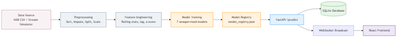

<div align="center">
  <p>
    <a href="https://www.python.org/"></a>
    <a href="https://fastapi.tiangolo.com/"></a>
    <a href="https://reactjs.org/"></a>
    <a href="https://www.docker.com/"></a>
    <a href="https://scikit-learn.org/"></a>
    <a href="LICENSE"></a>
  </p>

  

  <h1>Real-Time Industrial Anomaly Detection Platform</h1>
  <p><strong>A real-time MLOps platform for industrial IoT anomaly detection: stream simulation, multi-model comparison, alert management, drift monitoring, and a growing multi-modal (vibration + vision) extension.</strong></p>

  **[👉 Read the Final Project Report (PDF)](docs/final_report/FINAL_PROJECT_REPORT.pdf)**
</div>

---

## 1. Overview

This is a real-time MLOps platform for industrial anomaly detection built
around one working core loop:

`historical CSV → Stream Simulator → FastAPI /predict → rolling feature engineering → ML inference → SQLite → WebSocket → React frontend`

It replays a real industrial temperature dataset as a live sensor feed,
scores each reading against a registry of **seven trained unsupervised
models**, and gives an operator a live dashboard, an alert lifecycle, model
comparison tooling, drift monitoring, and a retraining workflow — all
genuinely implemented and evaluated, not just scaffolded.

Two additional sensor modalities — vibration (real NASA Bearing data) and
visual inspection (a real casting-defect image dataset) — extend the same
architecture and are wired end-to-end with their own trained models and
frontend pages.

This README states plainly what is implemented, what is partial, and what
is roadmap-only. For the full academic writeup with formulas, figures, and
a section-by-section breakdown, see the
**[Final Project Report](docs/final_report/FINAL_PROJECT_REPORT.pdf)**.

## 2. Business Problem

- **Static thresholds are weak.** Industrial machines fluctuate with load,
  ambient temperature, and age. A fixed rule like "alert if > 80°C" can't
  capture that.
- **Anomalies are rare.** Labeled failure data is scarce, which is exactly
  why this project uses unsupervised models rather than standard
  supervised classification.
- **False alarms and missed alarms both matter.** A high false-alarm rate
  causes operator fatigue; a single missed failure can mean unplanned
  downtime. See §8 for how differently the seven trained models actually
  perform on this trade-off.
- **Early detection enables scheduled, not emergency, maintenance.**

## 3. Solution

- **Data pipeline** — chronological split, forward-fill imputation,
  train-only-fit scaling (`src/data/`).
- **Feature engineering** — causal rolling statistics (`src/features/`).
- **ML models** — 7 unsupervised models trained and fairly compared on an
  identical held-out test split (`src/models/`).
- **Model registry** — JSON-backed, hot-swappable production model
  (`src/registry/`).
- **FastAPI backend** — async ingestion, alerting, drift, retraining,
  fault injection (`src/api/`).
- **WebSocket streaming** — live telemetry + alert broadcast.
- **SQLite** — readings, alerts, model runs, assets (`src/database/`).
- **React frontend** — 12 routed pages (`frontend/`).
- **Docker Compose** — two-service deployment (`docker-compose.yml`).

## 4. Current Implementation Status

| Feature | Status | Notes |
|---|---|---|
| NAB temperature stream | ✅ Implemented | `data/raw/realKnownCause/machine_temperature_system_failure.csv` |
| Stream simulator | ✅ Implemented | `src/streaming/stream_simulator.py`, replays historical data at configurable speed |
| FastAPI backend | ✅ Implemented | Async ASGI, 20+ endpoints — see §10 |
| SQLite database | ✅ Implemented | Readings, alerts, model runs, assets |
| WebSocket streaming | ✅ Implemented | `/ws/stream` — live-updating charts; exact render rate not benchmarked |
| React frontend | ✅ Implemented | 12 pages, all routed and functional |
| Model comparison (7 models) | ✅ Implemented | `reports/evaluation_results.csv`, real metrics — see §8 |
| Model registry / hot-swap | ✅ Implemented | `POST /models/select/{name}` reloads the active model in-process (no server restart required — not benchmarked as a formal "zero-downtime" guarantee under concurrent load) |
| Alert lifecycle | ✅ Implemented | Real UI-reachable states are `new → investigating → resolved`; `acknowledged` is a separate flag (see full report §15) |
| Drift detection (PSI) | ✅ Implemented | `src/drift/`, `GET /drift/status` |
| Retraining workflow | ✅ Implemented | `POST /models/retrain`; auto-promotes if a new model beats production. A real `ImportError` bug in the promotion step was found and fixed during this project's cleanup pass |
| Synthetic fault injection | ✅ Implemented | 5 real fault types (`spike`, `gradual_drift`, `sensor_stuck`, `missing_values`, `noise_burst`); 2 more are declared in the request schema but not verified in the generator |
| Incident report PDF | ✅ Implemented | `GET /reports/incident/{id}`, ReportLab |
| Vibration module (NASA Bearing) | ✅ Implemented | Real 20kHz bearing data, RMS/FFT features, Isolation Forest; no dedicated test file yet, no PR-AUC-style eval table yet |
| Visual inspection module | ✅ Implemented | Real casting-defect image dataset (**not** MVTec AD), ResNet18 embeddings (**not** ResNet50) + Isolation Forest; no dedicated test file yet |
| Asset Center | ✅ Implemented | Real unified list across modalities from the `Asset` table — a shared view, not a fused multi-modal score |
| Model artifact tracking | ⚠️ Partial | Models were pickled with scikit-learn 1.7.2; `requirements.txt` pins 1.5.1 — a real version mismatch, flagged not hidden |
| LSTM Autoencoder ROC-AUC/PR-AUC | ⚠️ Partial | F1/Precision/Recall are correct; ROC-AUC/PR-AUC in `evaluation_results.csv` are affected by a known sign-convention bug in `evaluate_all.py` — see full report §9 |
| TimescaleDB / PostgreSQL migration | 🧭 Roadmap | Currently SQLite only |
| Kafka / MQTT ingestion | 🧭 Roadmap | Currently a historical-data replay simulator, not a pub/sub broker |
| Reinforcement-learning control | 🧭 Roadmap | Not started |

## 5. Architecture

```
CSV → Stream Simulator → FastAPI /predict → Rolling Buffer → Feature Engineering
   → Model Inference → SQLite → WebSocket Broadcast → React Frontend
```


See `docs/final_report/figures/` for the complete set of architecture,
pipeline, and workflow diagrams (indexed in
`docs/final_report/figures/FIGURES_INDEX.md`).

## 6. Dataset

**Primary: Numenta Anomaly Benchmark (NAB)**,
`realKnownCause/machine_temperature_system_failure.csv`.

- Columns: `timestamp`, `value` (°F).
- Chronological, unlabeled at the point level, with NAB's own curated
  ground-truth anomaly windows.
- **Why chosen:** it's a standard benchmark specifically because it has
  real ground-truth windows for unsupervised time-series detection —
  most real industrial data has no labels at all.
- **Limitation:** univariate — no multivariate correlation (temperature +
  pressure + vibration) available in this dataset.

**Also used, by the two extended modalities:**
- **NASA Bearing Dataset (IMS Test 2)** — real, 500 timestamped 20kHz
  vibration snapshots (`data/raw/bearing/2nd_test/`). ✅ Implemented (§4).
- **A real casting-defect image dataset** — 8,258 real images
  (`data/raw/vision/`). ✅ Implemented (§4). This is **not** MVTec AD —
  correcting an earlier documentation claim. A synthetic pill-image
  generator also exists as a fallback data source
  (`src/synthetic/generate_vision_data.py`) but is not what's currently
  trained on.

## 7. Machine Learning Models

All 7 models trained and evaluated on the **same held-out test split**.
Metrics below are copied directly from `reports/evaluation_results.csv`.

| Model | Status | Artifact | Purpose | F1 | Precision | Recall |
|---|---|---|---|---|---|---|
| **Isolation Forest** | ✅ Production | `models/isolation_forest.pkl` | Fast, high-accuracy default | 0.9468 | 0.8989 | 1.0000 |
| **LSTM Autoencoder** | ✅ Implemented | `models/lstm_autoencoder.pkl` | Highest F1; ~2.6× slower than IF | 0.9921 | 0.9883 | 0.9961 |
| One-Class SVM | ✅ Implemented | `models/one_class_svm.pkl` | Non-linear boundary | 0.7922 | 0.6559 | 1.0000 |
| Local Outlier Factor | ✅ Implemented | `models/lof.pkl` | Density-based | 0.5443 | 0.3739 | 1.0000 |
| Elliptic Envelope | ✅ Implemented | `models/elliptic_envelope.pkl` | Gaussian covariance (honest negative result — 99.97% false alarm rate) | 0.2594 | 0.1490 | 1.0000 |
| Rolling Z-score | ✅ Implemented | *(no artifact — direct threshold)* | Baseline, proves ML is worth it | 0.2119 | 0.1398 | 0.4379 |
| River HalfSpaceTrees | ✅ Implemented | `models/river_online.pkl` | Online/incremental learning | 0.0472 | 0.0412 | 0.0552 |

*LSTM's ROC-AUC/PR-AUC in the raw CSV are not reliable — see the
Implementation Status table and the full report §9 for the identified
root cause. Its F1/Precision/Recall above are correct.*

Why Isolation Forest is the production default despite lower F1 than
LSTM: **latency**. 0.0067 ms vs. 0.0177 ms per prediction — the difference
that matters once serving many concurrent readings.

## 8. Feature Engineering

Implemented in `src/features/feature_engineering.py`, windows of 5/15/60
steps, 22 total feature columns:

- **Rolling mean** — `μ_w(t) = (1/w)·Σ x(t-i)` — smooths noise.
- **Rolling std** — proxy for local volatility.
- **EWMA** — `EWMA(t) = α·x(t) + (1-α)·EWMA(t-1)`, `α = 2/(w+1)` — weights
  recent points more.
- **Lag features** (`lag_1`, `lag_2`, `lag_3`) — short-horizon history.
- **Rate of change** — `x(t) - x(t-1)` — catches sudden spikes.
- **Z-score** — `(x(t) - μ_w(t)) / (σ_w(t) + ε)` — deviation in local
  standard deviations; this is exactly what the Rolling Z-score baseline
  model thresholds.

All features are computed causally (no future data), verified by
`tests/test_leakage.py`. **Correction:** an earlier version of this README
claimed hour-of-day/day-of-week cyclical encodings — these do not exist in
the current feature engineering code and have been removed from this
description.

## 9. API

**Implemented** (`src/api/main.py` + included routers):

```
GET  /health                        Liveness check
POST /predict                       Ingest one reading
POST /predict/batch                 Ingest many readings
POST /predict/ensemble              Score against all registered models
GET  /alerts                        List alerts
PUT  /alerts/{id}/ack                Acknowledge
PUT  /alerts/{id}/status             Change status (new/investigating/resolved)
PUT  /alerts/{id}/feedback           Record true/false-positive feedback
PUT  /alerts/{id}/replay             Replay alert context
GET  /reports/incident/{alert_id}   PDF incident report
GET  /models, /models/registry, /models/comparison   Registry reads
POST /models/select/{name}          Hot-swap production model
POST /models/retrain                Trigger retraining (auto-promotes)
GET  /drift/status, /drift/check, /drift/history      Drift monitoring
POST /faults/inject, /faults/stop   Synthetic fault control
GET  /faults/status, /faults/types
GET  /experiments                   Training run history
GET  /data/summary, /system/status, /metrics, /readings
WS   /ws/stream                     Live telemetry + alert broadcast
/vibration/*                        Vibration module (sample, ws/stream)
/image/*                            Vision module (gallery, analyze)
/assets/*                           Asset Center
```

**Documented before but does not exist:** `POST /retraining/promote/{model_id}`.
Promotion actually happens automatically inside the retraining job itself;
manual hot-swapping of any model (independent of retraining) is
`POST /models/select/{name}` above.

## 10. Frontend

React 19 + TypeScript + Vite + TailwindCSS + TanStack Query + Recharts +
framer-motion. All pages are real and routed in `frontend/src/App.tsx`:

Overview · Live Monitor · Alert Center · Data Explorer · Demo Control
Panel · Model Lab · Experiment Log · Retraining Center · System Health ·
Asset Center · Vibration Lab · Vision Lab

**Honest caveat:** the Vibration Lab, Vision Lab, and Asset Center pages
currently call their backend with a hardcoded `localhost:8000` URL instead
of the shared, environment-configured API client the other 9 pages use —
they work against the default local setup but need a small fix to point
at a different host.

## 11. Installation

### Docker (recommended)
```bash
git clone https://github.com/ahmedmoatasem01/Real-Time-Anomaly-Detection-for-IoT-Sensor-Streams.git
cd Real-Time-Anomaly-Detection-for-IoT-Sensor-Streams
docker compose up --build
```
UI at `http://localhost:3000`, API docs at `http://localhost:8000/docs`.

### Backend (local)
```bash
python -m venv .venv
.venv\Scripts\activate        # Windows
pip install -r requirements.txt
python -m uvicorn src.api.main:app --host 0.0.0.0 --port 8000 --reload
```

### Frontend (local)
```bash
cd frontend
npm install
npm run dev
```

### Stream simulator
```bash
python -m src.streaming.stream_simulator --speed 50 --loop
```

## 12. Training and Evaluation Commands

```bash
python -m src.models.train_baseline
python -m src.models.train_isolation_forest
python -m src.models.train_one_class_svm
python -m src.models.train_lof
python -m src.models.train_elliptic_envelope
python -m src.models.train_lstm_autoencoder
python -m src.models.train_river_online
python -m src.models.evaluate_all          # writes reports/evaluation_results.csv

python -m src.vibration.train              # vibration module
python -m src.image.train                  # vision module
```

## 13. Testing

```bash
pytest -q                    # 33 tests, 11 files — currently all passing
python -m pytest              # equivalent

cd frontend && npm run build  # TypeScript + Vite build — currently passing

docker compose config          # validate compose syntax
```

Not yet covered by a dedicated test file: the vibration module, vision
module, Asset Center, model registry, and retraining pipeline (they are
functional — see §4 — just untested by an automated suite so far).

## 14. Demo Workflow

1. Start the API, frontend, and stream simulator (§11).
2. Open the frontend at `http://localhost:3000` (or `:5174` in dev mode)
   and go to **Live Monitor** — observe the waveform and anomaly score.
3. Go to **Demo Control Panel**, click **Inject Spike Fault**.
4. Watch the anomaly score spike; a new alert appears in **Alert Center**.
5. Open the alert, move it to `investigating`, add a note, move it to
   `resolved`.
6. Download its incident report PDF.
7. Check **System Health** for the resulting drift shift.
8. Try **Retraining Center** → trigger a retraining run → see it logged
   in **Experiment Log**.

## 15. Project Structure

```
Real-Time-Anomaly-Detection-for-IoT-Sensor-Streams/
├── data/                      # Raw + processed datasets, SQLite files
├── docker/                    # API Dockerfile
├── docs/
│   ├── final_report/          # Final report (.md + .pdf), figures, sections
│   ├── model_cards/            # Per-model documentation
│   └── archive/                # Superseded planning documents
├── frontend/                  # React + Vite application
├── models/                    # Trained artifacts + model_registry.json
├── reports/                   # evaluation_results.csv, drift/experiment history
├── scripts/                   # Diagram/report/figure generation, demo reset
├── src/
│   ├── api/                   # FastAPI app, routers, inference service
│   ├── data/, features/       # Preprocessing, feature engineering
│   ├── models/                # Training scripts + evaluate_all.py
│   ├── registry/, drift/, retraining/, synthetic/, reports/
│   ├── vibration/, image/     # Extended modalities
│   ├── database/, streaming/, utils/
├── tests/                     # pytest suite (11 files, 33 tests)
├── docker-compose.yml
└── requirements.txt
```

Full folder-by-folder guide: `docs/PROJECT_STRUCTURE.md`.

## 16. Roadmap

**Near-term:**
- Fix the LSTM ROC-AUC/PR-AUC sign bug in `evaluate_all.py`.
- Dedicated tests for vibration, vision, asset, registry, retraining.
- Route the three hardcoded-URL frontend pages through the shared API client.
- Re-pin `requirements.txt` to match the scikit-learn version models were trained with.

**Advanced:**
- Migrate SQLite → PostgreSQL/TimescaleDB.
- Replace the stream simulator with real Kafka/MQTT ingestion.
- Multivariate correlation modeling across sensor channels.
- Reinforcement learning for automated control corrections.

## 17. Limitations

- Primary dataset is univariate (temperature only).
- "Live" data is a historical replay, not a true pub/sub ingestion path.
- SQLite may hit write-locking limits under heavy concurrent load.
- Model artifacts were pickled with a newer scikit-learn than
  `requirements.txt` currently pins.
- Vibration/vision modules have no dedicated automated tests yet and no
  PR-AUC-style evaluation table comparable to §7.
- No claim of a specific measured frame rate or a formal zero-downtime
  guarantee is made anywhere in this document — both were removed from
  this description because neither has been benchmarked.

## 18. Final Report

The complete, section-by-section academic report — including every
formula explained (rolling mean, std, EWMA, z-score, PSI, RMS, FFT,
autoencoder reconstruction error), full API/JSON examples, and every
correction noted above with its source — is here:

**[docs/final_report/FINAL_PROJECT_REPORT.pdf](docs/final_report/FINAL_PROJECT_REPORT.pdf)**
(source: [FINAL_PROJECT_REPORT.md](docs/final_report/FINAL_PROJECT_REPORT.md))
