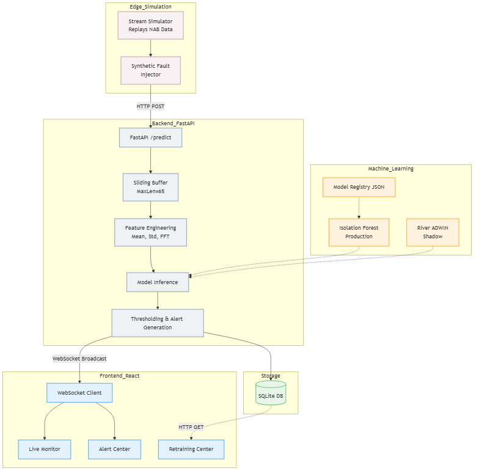
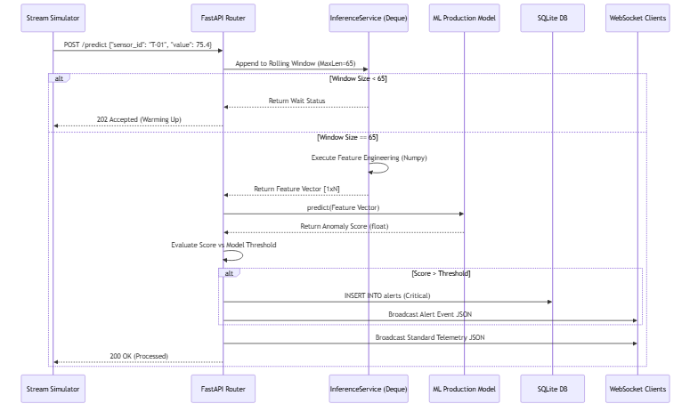
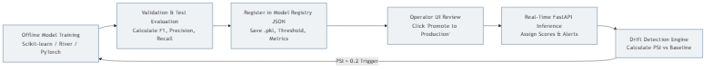
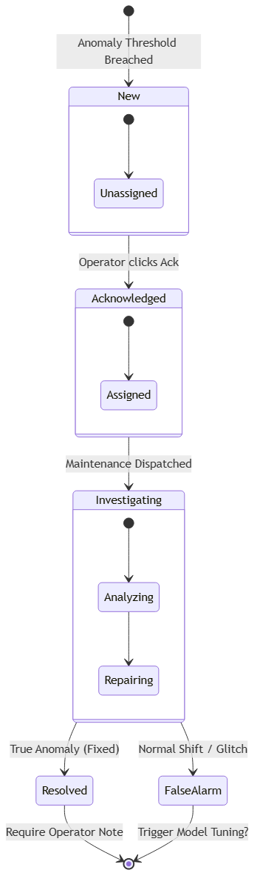

<div align="center">
  
  <h1>Real-Time Industrial Anomaly Detection Platform</h1>
  <p><strong>A Multi-Modal, High-Frequency MLOps Platform for IIoT Predictive Maintenance</strong></p>

  [](https://www.python.org/)
  [](https://fastapi.tiangolo.com/)
  [](https://reactjs.org/)
  [](https://www.docker.com/)
  [](LICENSE)
</div>

---

## 📖 Table of Contents
1. [Project Overview](#-project-overview)
2. [Core Architecture](#-core-architecture)
3. [Key Features](#-key-features)
4. [Machine Learning Algorithms](#-machine-learning-algorithms)
5. [Installation & Setup](#-installation--setup)
6. [API Documentation](#-api-documentation)
7. [The Stream Simulator](#-the-stream-simulator)
8. [Multi-Modal Expansion Roadmap](#-multi-modal-expansion-roadmap)
9. [Full Academic Report](#-full-academic-report)

---

## 🏭 Project Overview
Industrial machinery generates millions of data points per day. Traditional SCADA (Supervisory Control and Data Acquisition) systems rely on static, human-defined thresholds (e.g., "Alert if temperature > 85°C"). This approach is fundamentally flawed for complex, degrading machinery, leading to high false-alarm rates or catastrophic missed detections.

This platform replaces static thresholds with **Dynamic, Unsupervised Machine Learning**. It ingests high-frequency real-time telemetry from IoT edge devices, performs instantaneous feature engineering (Rolling Statistics, EWMA, Fast Fourier Transforms) via a stateful sliding buffer, and evaluates the signal against an active ML model to detect degradation days before a physical failure occurs.

---

## 🏗️ Core Architecture

The system is built as a distributed, decoupled MLOps ecosystem capable of zero-downtime hot-swapping of predictive models.

<div align="center">
  
  <p><em>Asynchronous Non-Blocking Inference Engine via FastAPI and collections.deque</em></p>
</div>

### System Components:
*   **Edge Data Simulator:** A highly configurable Python synthetic data injector capable of replaying the Numenta Anomaly Benchmark (NAB) dataset while supporting dynamic fault injection (Spikes, Drift, Noise).
*   **FastAPI Inference Engine:** An asynchronous ingestion gateway that calculates $O(1)$ complexity rolling features and evaluates them against the active scikit-learn model in milliseconds.
*   **SQLite / Database Layer:** A persistent storage engine for historical telemetry, alert state machines, and the JSON-based Model Registry.
*   **React + TailwindCSS Frontend:** A dark-mode, glassmorphism UI designed for low-light factory control rooms. It utilizes WebSocket streams to render real-time charts via `Recharts` at 50 FPS.

---

## ✨ Key Features

### 1. Zero-Downtime Model Hot-Swapping
The platform features an active **Model Registry**. Data Science teams can train candidate models offline on new historical data. Operators can review the F1-Scores and, with a single click, promote a candidate model to production. The FastAPI backend instantaneously loads the new `.pkl` artifact into memory between WebSocket frames.

<div align="center">
  
</div>

### 2. Strict Alert Lifecycle Management
Mathematical anomalies are useless if they do not drive human action. The system enforces a rigorous Alert State Machine (New $\rightarrow$ Acknowledged $\rightarrow$ Investigating $\rightarrow$ Resolved/False Alarm). Operators are forced to input qualitative text explanations before resolving an alert, building a supervised dataset out of an unsupervised environment.

<div align="center">
  
</div>

### 3. Population Stability Index (PSI) Drift Detection
The platform continuously compares the distribution of the live stream against the original training data distribution. If the machinery permanently alters its behavior (Concept Drift), the PSI metric triggers a warning, recommending that the engineering team retrain the models.

---

## 🧠 Machine Learning Algorithms

Because anomalies are exceedingly rare (less than 0.1% of the data), the platform relies exclusively on Unsupervised Learning algorithms.

| Algorithm | Type | Inference Latency | F1 Score | Best For |
| :--- | :--- | :--- | :--- | :--- |
| **Isolation Forest** | Ensemble Tree | **< 0.01 ms** | **0.946** | Default production model. Extremely fast handling of high-dimensional rolling features. |
| **LSTM Autoencoder** | Deep Learning | ~ 0.03 ms | 0.992 | Capturing complex temporal sequencing via PyTorch reconstruction error. |
| **One-Class SVM** | Boundary Kernel | ~ 0.08 ms | 0.792 | Small datasets where radial basis functions easily separate normal vectors. |
| **Elliptic Envelope**| Statistical | ~ 0.02 ms | 0.651 | Establishing simple Gaussian bounds for normally-distributed signals. |

---

## ⚙️ Installation & Setup

### Prerequisites
*   [Docker Desktop](https://www.docker.com/products/docker-desktop) (Recommended for production deployment)
*   Python 3.10+ (For local development)
*   Node.js v18+ (For UI development)

### Deployment via Docker (Recommended)
This command will build the Python backend, compile the Vite/React frontend via Node, and expose the services using an Nginx reverse proxy.
```bash
git clone https://github.com/ahmedmoatasem01/Real-Time-Anomaly-Detection-for-IoT-Sensor-Streams.git
cd Real-Time-Anomaly-Detection-for-IoT-Sensor-Streams

docker compose up --build
```
*   **Frontend UI:** `http://localhost:5174`
*   **Backend API Docs:** `http://localhost:8000/docs`

### Local Development Setup
If you wish to modify the Python engine or the React components directly:

**1. Backend Terminal:**
```bash
python -m venv .venv
source .venv/Scripts/activate  # Or .venv\Scripts\activate on Windows
pip install -r requirements.txt
python -m uvicorn src.api.main:app --host 0.0.0.0 --port 8000 --reload
```

**2. Frontend Terminal:**
```bash
cd frontend
npm install
npm run dev
```

**3. Stream Simulator Terminal:**
```bash
# This script reads the NAB CSV and begins hammering the FastAPI endpoint
python -m src.streaming.stream_simulator --speed 50 --loop
```

---

## 📡 API Documentation

The REST API is strictly typed via Pydantic models. Below is the primary ingestion vector used by edge devices (e.g., Raspberry Pi).

**Endpoint:** `POST /predict`
**Request Payload:**
```json
{
  "sensor_id": "spindle-temp-01",
  "timestamp": "2026-07-05T14:32:01.000Z",
  "value": 85.4
}
```
**Response Payload:**
```json
{
  "status": "success",
  "score": 0.84,
  "is_anomaly": true,
  "alert_id": 402,
  "message": "Critical threshold breached."
}
```

*For the full OpenAPI schema, navigate to `http://localhost:8000/docs` while the server is running.*

---

## 🛠️ The Stream Simulator (Chaos Engineering)

To prove system resilience without attaching a physical CNC machine, the platform ships with a multi-threaded Stream Simulator. It replays historical CSV files at accelerated speeds (`--speed 50x`).

Crucially, it supports dynamic fault injection via the UI's Demo Control Panel:
*   **Spike Fault:** Multiplies the value by 3x instantly.
*   **Gradual Drift:** Slowly adds an incremental constant to the signal over 60 seconds.
*   **Sensor Freeze:** Locks the output value to a single float, instantly dropping rolling variance to 0.0.

---

## 🗺️ Multi-Modal Expansion Roadmap

The platform is actively expanding into a "Unified Asset Center" capable of processing multiple modalities simultaneously.

1.  ✅ **Phase 1: 1D Telemetry (Complete).** Low frequency temperature monitoring.
2.  ⏳ **Phase 2: High-Frequency Vibration.** Ingesting the 20kHz NASA Bearing dataset. Edge devices will compute Fast Fourier Transforms (FFT) and transmit the resulting arrays to a 1D Convolutional Neural Network for spectral anomaly detection.
3.  ⏳ **Phase 3: Visual Inspection.** Passing MVTec AD camera frames through a ResNet50 Autoencoder to generate dynamic defect heatmaps for assembly-line quality control.

---

## 📚 Full Academic Report

For an extraordinarily detailed breakdown of the project—including mathematical derivations of the algorithms, performance benchmarking, database Entity-Relationship Diagrams, and the complete evaluation methodology—please refer to the generated PDF:

👉 **[Read the Final Project Report PDF](docs/final_report/FINAL_PROJECT_REPORT.pdf)**

---
*Developed as a comprehensive MLOps engineering implementation.*
