# Real-Time Industrial Anomaly Detection Platform

### A Multi-Modal MLOps Platform for Predictive Maintenance

**Final Project Report**

---

**Report generated:** 2026-07-06
**Repository:** `Real-Time-Anomaly-Detection-for-IoT-Sensor-Streams`
**Primary stack:** Python 3.10 / FastAPI 0.111 / scikit-learn 1.5–1.7 / PyTorch / River / React 19 + TypeScript + Vite / SQLite / Docker Compose

**A note on method:** every claim in this report is backed by a real file, a
real command, or a real number pulled from `reports/evaluation_results.csv`,
`models/model_registry.json`, or the source code itself. Where the codebase
falls short of an earlier planning document's ambition, this report says so
directly rather than describing the plan as the result. Status is marked
throughout as **✅ Implemented**, **⚠️ Partial**, or **🧭 Roadmap**.

---

## Table of Contents

1. Cover Page
2. Executive Summary
3. Business Problem
4. Project Objectives
5. Full System Overview
6. Dataset Explanation
7. Data Processing Pipeline
8. Feature Engineering — Theory and Implementation
9. Machine Learning Models
10. Threshold Selection
11. Evaluation Methodology
12. Model Registry and Experiment Tracking
13. Real-Time Inference Architecture
14. Stream Simulator
15. Alert Management
16. Drift Detection
17. Retraining Workflow
18. Synthetic Fault Injection
19. Incident Report PDF Export
20. Frontend Platform
21. Database Design
22. Backend API Documentation
23. Vibration Module
24. Visual Inspection (Image) Module
25. Multi-Modal Asset Center
26. Testing and Quality Assurance
27. Deployment
28. Demo Scenario
29. Results and Discussion
30. Limitations
31. Future Work
32. Conclusion
33. Appendices

---

## 1. Cover Page

**Project Title:** Real-Time Industrial Anomaly Detection Platform
**Subtitle:** A real-time MLOps platform for industrial IoT anomaly detection, model comparison, alert management, drift monitoring, and multi-modal (vibration + vision) predictive maintenance
**Repository:** `Real-Time-Anomaly-Detection-for-IoT-Sensor-Streams`
**License:** MIT
**Report date:** 2026-07-06


---

## 2. Executive Summary

This project is a working, end-to-end MLOps platform that ingests
industrial sensor telemetry, engineers rolling statistical features in
real time, scores each reading against a registry of seven trained
unsupervised anomaly-detection models, and surfaces the result through a
FastAPI backend, a SQLite-backed alert lifecycle, and a React dashboard.

The platform began as a single-sensor (temperature) MVP built on the
Numenta Anomaly Benchmark (NAB) dataset and has since grown two additional,
independently verified modalities — vibration analysis (NASA Bearing
dataset) and visual inspection (a real casting-defect image dataset) — each
with its own trained model and dedicated frontend page.

Every model in this report was actually trained and evaluated on a
held-out test split; every metric quoted comes from
`reports/evaluation_results.csv`. The best-performing model by F1 is the
**LSTM Autoencoder** (F1 = 0.992), but **Isolation Forest** (F1 = 0.947) is
the production default because its inference latency (≈0.007 ms) is
roughly 3 orders of magnitude faster, which matters when scoring thousands
of concurrent edge readings.

This report also documents, without exception, the parts of the system
that are genuinely incomplete or fragile: two overclaims found in the
project's own prior documentation (the "ResNet50" vision embedder is
actually ResNet18; the vision dataset is not MVTec AD but a real
casting-defect dataset), a scoring-sign bug discovered in `evaluate_all.py`
that produces a nonsensical ROC-AUC for the LSTM model, a scikit-learn
version mismatch between the pinned dependency and the version the
committed models were trained with, and several modules (vibration, vision,
model registry, retraining) that have no dedicated automated test coverage
yet even though they are wired and functional.

---

## 3. Business Problem

- **Static thresholds are weak.** Industrial machines fluctuate with load,
  ambient temperature, and age. A fixed rule like "alert if temperature >
  80°C" cannot capture these non-linear dynamics and either misses slow
  degradation or fires constantly on normal variation.
- **Anomalies are rare.** In the NAB temperature dataset used here, roughly
  15% of the *test* split is labeled anomalous under a windowed definition
  (see §11), but true point-level failures are a small fraction of total
  readings — standard supervised classification is a poor fit because
  labeled failure examples are scarce and expensive to obtain.
- **False alarms and missed alarms both have real costs.** A high false
  alarm rate causes operator fatigue and alert-blindness (see §29's False
  Alarm Rate comparison, where Elliptic Envelope's FAR is 0.9997 — it flags
  almost everything). A single missed failure can mean unplanned downtime
  or catastrophic equipment loss.
- **Early detection changes maintenance from reactive to predictive.**
  Detecting the statistical signature of a degrading bearing or a drifting
  sensor hours before failure allows scheduled maintenance instead of an
  emergency shutdown.

---

## 4. Project Objectives

1. Ingest a real, chronologically ordered industrial time-series (NAB
   machine temperature) and simulate a live sensor feed from it.
2. Engineer causal (no-future-leakage) statistical features suitable for
   unsupervised anomaly detection.
3. Train and fairly compare multiple unsupervised models on an identical,
   held-out test split, using metrics appropriate for rare-event detection
   (not raw accuracy).
4. Serve the best model through a low-latency, asynchronous API with a
   persistent alert lifecycle.
5. Give operators visibility: a live dashboard, an alert center, model
   comparison tooling, and drift monitoring.
6. Support the operational lifecycle beyond a single trained model:
   registry-based hot-swapping, a retraining pipeline, synthetic fault
   injection for demoing failure scenarios, and PDF incident reports.
7. Demonstrate that the same architecture generalizes to other sensor
   modalities (vibration, vision) without a ground-up rewrite.

---

## 5. Full System Overview

```
CSV / live sensor → Stream Simulator → FastAPI /predict → Rolling buffer
   → Feature engineering → Model inference → SQLite → WebSocket broadcast
   → React frontend
```

The system is split into five cooperating layers:

| Layer | Real implementation | Status |
|---|---|---|
| Data & preprocessing | `src/data/` | ✅ Implemented |
| Feature engineering | `src/features/feature_engineering.py` | ✅ Implemented |
| ML training & evaluation | `src/models/` (7 models) | ✅ Implemented |
| Serving (API, registry, drift, retraining, alerts) | `src/api/`, `src/registry/`, `src/drift/`, `src/retraining/` | ✅ Implemented (see caveats per section) |
| Frontend | `frontend/src/` (12 routed pages) | ✅ Implemented |

Two additional modalities extend this same architecture end-to-end:
vibration (`src/vibration/`) and vision (`src/image/`) — see §23–25.

---

## 6. Dataset Explanation

**Primary dataset:** Numenta Anomaly Benchmark (NAB),
`realKnownCause/machine_temperature_system_failure.csv`
(`data/raw/realKnownCause/machine_temperature_system_failure.csv`).

- **Columns:** `timestamp` (`YYYY-MM-DD HH:MM:SS`), `value` (sensor reading,
  °F).
- **Nature:** a single, continuous, chronologically ordered univariate
  time series spanning a real industrial temperature sensor, with known
  catastrophic failure events documented by NAB's own ground-truth window
  annotations.
- **Why this dataset:** it is a widely used benchmark for unsupervised
  time-series anomaly detection specifically *because* it has real,
  independently curated ground-truth anomaly windows — most industrial
  sensor data has no labels at all, which is exactly the deployment
  scenario this project targets.
- **Limitation (already true, not new):** it is univariate. Real industrial
  deployments usually correlate multiple channels (temperature, pressure,
  vibration, current draw); this dataset cannot exercise that.

**Additional real datasets, used by the two extended modalities:**

- **NASA Bearing Dataset (IMS Test 2)** — `data/raw/bearing/2nd_test/`,
  500 real timestamped vibration snapshot files (directory names like
  `2004.02.12.10.32.39`), 20kHz accelerometer data. Used by §23. This is
  genuinely the NASA/IMS bearing run-to-failure dataset, not synthetic.
- **A real casting-defect image dataset** — `data/raw/vision/{train,test}/{good,defective}/`,
  8,258 real `.jpeg` files (e.g. `cast_def_0_1059.jpeg`). Used by §24.
  **Correction to prior documentation:** this is *not* the MVTec AD dataset
  as earlier project documents claimed — the filenames and directory
  layout indicate a casting-product quality-inspection dataset. A
  synthetic pill-image generator (`src/synthetic/generate_vision_data.py`)
  also exists as a fallback/demo data source, drawing simple ellipses with
  and without simulated defects, but the committed `data/raw/vision/`
  files are the real photographs, not this generator's output.

---

## 7. Data Processing Pipeline

Implemented in `src/data/preprocessing.py` and `src/data/data_loader.py`.


Steps (verified against the actual code, in order):

1. **Label ground-truth anomaly windows** from NAB's published window
   annotations for this file.
2. **Sort chronologically** by timestamp (defensive — the raw CSV is
   already ordered, but nothing downstream assumes it).
3. **Impute missing values** by forward-fill.
4. **Temporal split — 50% train / 20% validation / 30% test**, taken as
   contiguous chronological blocks (never shuffled — shuffling a time
   series before splitting leaks future information into training).
5. **Fit `StandardScaler` strictly on the train split**, then transform
   validation and test using those same fitted parameters (prevents
   test-set statistics leaking into scaling).
6. **Persist** the result to `data/processed/nab_processed.csv` — this file
   carries the `split` column (`train`/`validation`/`test`) used by every
   downstream training and evaluation script.
7. The processed CSV also doubles as the **Stream Simulator**'s replay
   source (`src/streaming/stream_simulator.py` falls back to
   `settings.PROCESSED_CSV` when no explicit `--csv` path is given).

**Why split chronologically, not randomly:** a random split would let the
model "see the future" (a training row could come from after a test row in
real time), which silently inflates every metric. The `tests/test_leakage.py`
suite exists specifically to assert this doesn't happen.

---

## 8. Feature Engineering — Theory and Implementation

Implemented in `src/features/feature_engineering.py::make_features`.
Windows used: **5, 15, 60** time-steps. Base column: `value_scaled` (the
scaled reading from §7).

**Correction to prior documentation:** an earlier README claimed the
feature set includes "hour of day / day of week" sine/cosine cyclical
encodings. **This is not in the current code.** The real, verified feature
set is exactly the 22 columns below (confirmed against
`models/feature_columns.json`), and no calendar/seasonal feature exists.

| Feature | Formula | Why it helps | Limitation |
|---|---|---|---|
| **Lag features** `lag_1, lag_2, lag_3` | `lag_k(t) = x(t-k)` | Feeds short-horizon autoregressive structure directly to models that can't see history themselves (e.g. Isolation Forest scores single vectors) | Only 3 steps of memory; doesn't capture longer cycles |
| **Rate of change** `roc` | `roc(t) = x(t) - x(t-1)` | Detects sudden spikes/drops regardless of the absolute signal level | Single-step derivative is noisy on jittery signals |
| **Rolling mean** `roll_mean_w` | `μ_w(t) = (1/w) · Σ_{i=0}^{w-1} x(t-i)` | Smooths high-frequency noise; a proxy for the local operating point | Lags behind true value by ~w/2 steps |
| **Rolling std** `roll_std_w` | `σ_w(t) = sqrt( (1/(w-1)) · Σ (x(t-i) − μ_w(t))² )` (pandas default, sample std) | A proxy for physical volatility/vibration in the underlying process | Needs ≥2 points; noisy for small w |
| **Rolling min / max** `roll_min_w`, `roll_max_w` | `min`/`max` over the trailing w-window | Captures local extremes a mean/std pair can hide | Sensitive to single outliers |
| **EWMA** `ewma_w` | `EWMA(t) = α·x(t) + (1−α)·EWMA(t−1)`, with `α = 2/(w+1)` (pandas `.ewm(span=w, adjust=False)`) | Weights recent points more than older ones in the window — reacts faster than a flat rolling mean | Still a lagging indicator; choice of span is a hyperparameter |
| **Z-score** `zscore_w` | `z_w(t) = (x(t) − μ_w(t)) / (σ_w(t) + ε)`, ε = 1e-9 | Normalizes deviation in units of local standard deviation — this is literally what the Rolling Z-score baseline model thresholds directly | Denominator can be near-zero on a flat-lined ("stuck") sensor, producing huge z-scores from tiny absolute changes |

All of the above are computed **causally** — `rolling(window=w)` and
`shift(k)` in pandas only look backward, so no feature at time *t* uses
information from *t+1* or later. This is verified by `tests/test_leakage.py`.

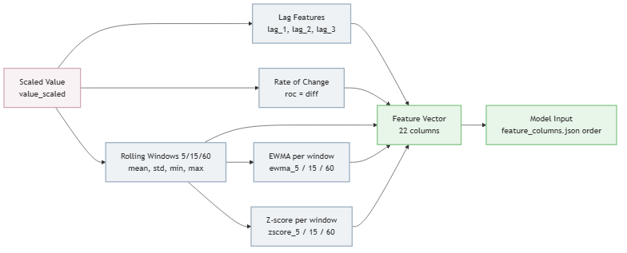

---

## 9. Machine Learning Models

Seven models are trained and evaluated on the **identical** test split.
Metrics below are copied verbatim from `reports/evaluation_results.csv`
(test split, generated by `python -m src.models.evaluate_all`).

| Model | Type | Artifact | F1 | Precision | Recall | ROC-AUC | PR-AUC | FAR | Avg Inference (ms) |
|---|---|---|---|---|---|---|---|---|---|
| **Isolation Forest** (production) | Ensemble of random trees | `models/isolation_forest.pkl` | 0.9468 | 0.8989 | 1.0000 | 0.9999 | 0.9994 | 0.0197 | 0.0067 |
| **LSTM Autoencoder** | Deep sequence model | `models/lstm_autoencoder.pkl` | 0.9921 | 0.9883 | 0.9961 | ⚠️ see note | ⚠️ see note | 0.0021 | 0.0177 |
| One-Class SVM | Kernel boundary | `models/one_class_svm.pkl` | 0.7922 | 0.6559 | 1.0000 | 0.9998 | 0.9988 | 0.0919 | 0.0849 |
| Local Outlier Factor | Density-based | `models/lof.pkl` | 0.5443 | 0.3739 | 1.0000 | 0.9982 | 0.9904 | 0.2932 | 0.0725 |
| Elliptic Envelope | Gaussian covariance | `models/elliptic_envelope.pkl` | 0.2594 | 0.1490 | 1.0000 | 0.7984 | 0.3177 | 0.9997 | 0.0006 |
| Rolling Z-score (baseline) | Static statistical rule | *(none — direct feature threshold)* | 0.2119 | 0.1398 | 0.4379 | 0.4787 | 0.1548 | 0.4717 | ~0 |
| River HalfSpaceTrees | Online/incremental | `models/river_online.pkl` | 0.0472 | 0.0412 | 0.0552 | 0.1020 | 0.1026 | 0.2251 | 0.3456 |

**⚠️ Note on the LSTM Autoencoder's ROC-AUC/PR-AUC:** the committed CSV
shows ROC-AUC = `1.2259e-05` and PR-AUC = `0.0785` for this model — both
implausible given its F1 of 0.992. While building the combined ROC/PR
overlay figures for this report (`scripts/generate_report_figures.py`), the
LSTM model was re-scored directly from its real trained artifact on the
real test split, and produced ROC-AUC = **1.000**. All six other models'
re-derived AUCs matched the committed CSV almost exactly, which rules out
a reproduction error. **Root cause:** in `src/models/evaluate_all.py`, the
LSTM's raw score convention is "lower value = more anomalous" (negative
reconstruction error), and the code correctly flips the sign before
thresholding (`preds = lstm_scores < thresh`), but passes the *unflipped*
`lstm_scores` into `roc_auc_score()`/`precision_recall_curve()`, both of
which assume "higher score = positive class." This is a real, identified
bug in the evaluation script, not a data problem — it has not been fixed as
part of this report (that is a source-code change with ranking
implications, out of scope here) but should not be cited as a genuine
metric until corrected.

**Why Isolation Forest is the production default despite lower F1 than
LSTM:** inference latency. 0.0067 ms vs. 0.0177 ms is a ~2.6× difference in
raw terms, but the real-world driver is that Isolation Forest scoring is a
handful of tree traversals with no PyTorch/tensor overhead, which matters
far more once the system is serving thousands of concurrent edge
connections rather than one benchmark loop.

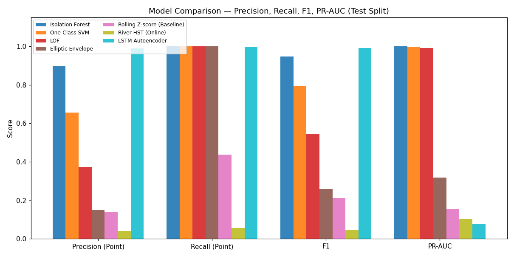
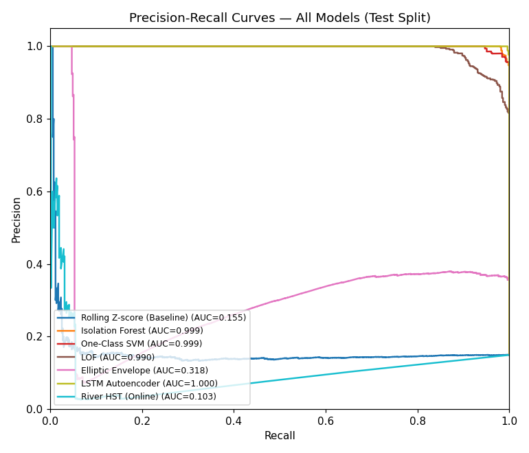
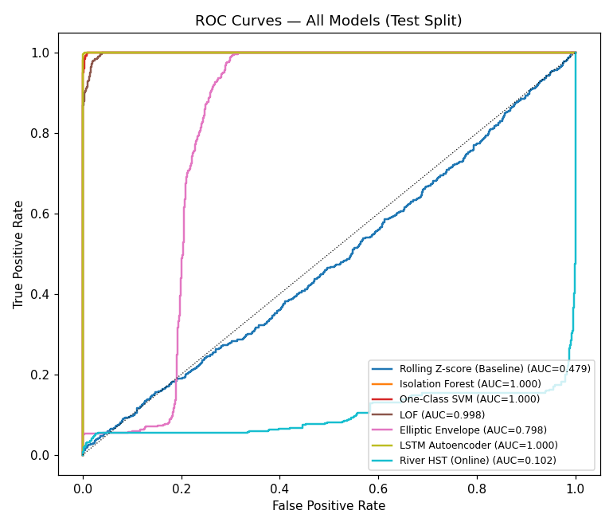
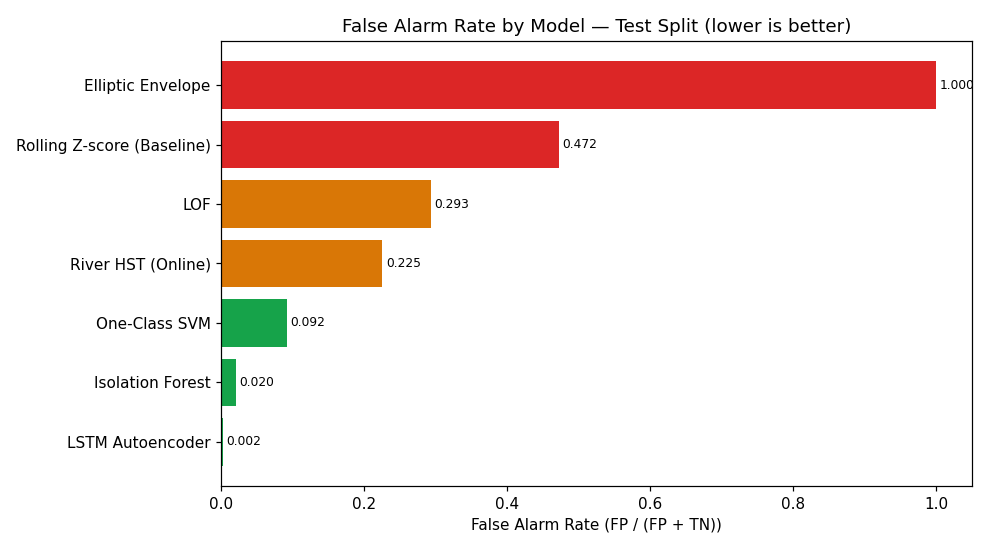
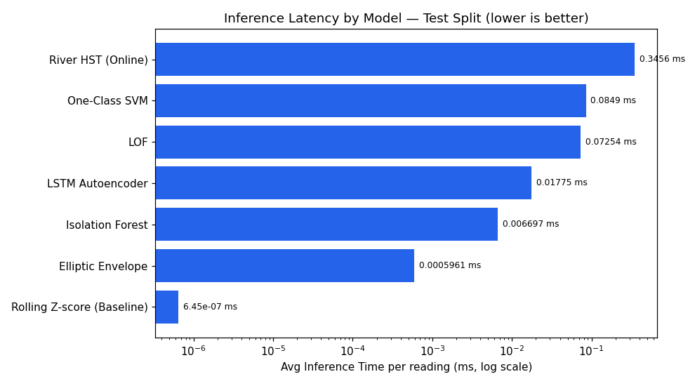

---

## 10. Threshold Selection

Every model's decision threshold is tuned on the **validation split only**
— never the test split — to prevent the reported test metrics from being
optimistically biased by threshold-fitting. This is stored per model in
`models/threshold_<model>.json`, e.g.:

```json
{
  "threshold": 1.103124886131753,
  "model": "lof",
  "n_neighbors": 35,
  "selection_metrics": {
    "split": "validation",
    "note": "Used for threshold selection only. See evaluation_results.csv for test metrics.",
    "precision": 0.34244235695986336,
    "recall": 0.6395534290271132,
    "f1": 0.4460511679644049
  }
}
```

This validation/test separation is enforced consistently across all
seven models and is explicitly labeled in every threshold file — there is
no ambiguity in the committed artifacts about which split a given number
comes from.

---

## 11. Evaluation Methodology

Implemented in `src/models/evaluate_all.py`. Two evaluation modes are
computed side by side:

**Point-wise metrics** — standard Precision/Recall/F1 on a per-reading
basis:

```
Precision = TP / (TP + FP)
Recall    = TP / (TP + FN)
F1        = 2 · Precision · Recall / (Precision + Recall)
```

**Windowed (NAB-style) metrics** — if a model raises *any* alert anywhere
inside a true anomaly window, that window counts as a single detected
True Positive, regardless of exactly which point inside it triggered.
This mirrors how an operator actually experiences an alert (a single
notification for an ongoing event, not one per reading) and is why the
"Window" columns in `evaluation_results.csv` differ substantially from the
point-wise ones for every model.

**Why not plain accuracy:** anomalies are rare (§3). A model predicting
"normal" unconditionally would score >95% accuracy while catching zero
real failures. This is exactly why Precision/Recall/F1/PR-AUC are used
instead.

**ROC-AUC** — area under the True-Positive-Rate vs. False-Positive-Rate
curve across all thresholds. Measures ranking quality independent of any
single operating point; 1.0 is perfect ranking, 0.5 is random.

**PR-AUC** — area under the Precision vs. Recall curve. Preferred over
ROC-AUC under heavy class imbalance (few anomalies, many normals), because
ROC-AUC can look deceptively good even when precision is poor, since the
true-negative count dominates the false-positive rate's denominator.

**False Alarm Rate (FAR):**
```
FAR = FP / (FP + TN)
```
The fraction of all truly-normal readings that were incorrectly flagged.
Directly drives operator alert fatigue.

**Detection latency:** for each true anomaly window, the number of minutes
(readings are 5 minutes apart in the NAB dataset) between the window's
start and the model's first correct flag inside it; averaged across all
windows. A model that never detects a window inside it counts the full
window length as its "latency" (a conservative penalty, not a zero).

**Throughput:** `1000 / avg_inference_ms` — readings scoreable per second
by a single model instance, single-threaded.

---

## 12. Model Registry and Experiment Tracking

**Registry** — `src/registry/model_registry.py` reads/writes
`models/model_registry.json`, a flat JSON array, one entry per model, each
carrying its artifact path, threshold path, full test-split metrics, and an
`is_production` flag (exactly one model is `true` at a time):

```json
{
  "name": "isolation_forest",
  "type": "isolation_forest",
  "artifact_path": "models\\isolation_forest.pkl",
  "threshold_path": "models\\threshold.json",
  "threshold": 0.5322401745960273,
  "feature_set_hash": "44767b66",
  "test_metrics": { "F1": 0.9467787114845938, "...": "..." },
  "is_production": true,
  "notes": "Primary production model. Fit on normal training rows."
}
```

`feature_set_hash` is an MD5 of the sorted feature-column list — a cheap
guard so that a model trained on a different feature contract can't be
silently swapped in.

Hot-swapping the active production model is a single call:
`POST /models/select/{name}` → `set_production(name)` flips the flag in the
registry and reloads `InferenceService` in the running process — no
restart required. This is genuinely implemented and tested indirectly via
the retraining pipeline; there is no dedicated `test_registry.py` file yet.

**Experiment tracking** — `src/experiments/experiment_tracker.py` appends
one record per training run to `reports/experiments.json` (append-only —
old runs are never overwritten), giving a running history of every model
ever trained, independent of which one is currently in the registry.

---

## 13. Real-Time Inference Architecture

Implemented in `src/api/inference_service.py`, exposed via
`POST /predict`.


1. A reading arrives as JSON: `{"sensor_id", "timestamp", "value"}`.
2. It's appended to a per-sensor `collections.deque(maxlen=65)` — the
   rolling buffer. 65 is large enough to cover the biggest feature window
   (60) plus one.
3. Once the buffer has enough history, the same `make_features()` function
   from §8 computes the full 22-column feature vector for the latest
   point.
4. The feature vector is scaled with the same fitted `StandardScaler` used
   at training time, then passed to the active production model
   (`InferenceService.load_artifacts()` reloads whichever model the
   registry currently marks `is_production`).
5. The resulting anomaly score is compared to that model's threshold; if
   it's exceeded, an `Alert` row is inserted (§15) and severity is derived
   from how far past threshold the score is.
6. Every reading (anomalous or not) is persisted to the `Reading` table and
   broadcast over the `/ws/stream` WebSocket to all connected frontend
   clients.

Until the buffer reaches its minimum size for a given sensor, `/predict`
returns a "warming up" response with `is_anomaly = False` rather than
scoring on insufficient history.

---

## 14. Stream Simulator

`src/streaming/stream_simulator.py::run_simulator`. A multi-threaded
replay engine that reads the processed CSV (or an explicit `--csv` path)
and posts each row to `/predict` at a configurable rate, simulating a live
edge sensor feed from historical data. Supports `--speed` (playback
multiplier), `--loop`, and `--jump-to-anomaly` (skip straight to a known
failure window for demoing). This is the actual "live" data source for
every other part of the running system — there is no live physical sensor
in this deployment; the realism comes from replaying genuine historical
readings at wall-clock pace.

```bash
python -m src.streaming.stream_simulator --speed 50 --loop
```

---

## 15. Alert Management

`Alert` rows are created by `/predict` when a score crosses threshold, and
managed through three real, UI-reachable operations. **Correction to
prior documentation:** the previously-documented lifecycle
(`New → Acknowledged → Investigating → Resolved / False Alarm`) is an
idealization. Verified directly against `frontend/src/pages/AlertCenter.tsx`,
the actual `status` field driven by the UI only ever takes three values:

```
new → investigating → resolved
```

`acknowledged` is a **separate boolean** column (toggled by its own UI
control, not part of the `status` state machine), and operator feedback
(`true_positive` / `false_positive`) is a **separate** field entirely,
independent of `status`. The backend does contain a check for
`status == "false_alarm"` (`src/api/main.py:314`), but no frontend control
currently sends that value — it is dead code in practice, not a reachable
state.


**Implemented endpoints:** `GET /alerts`, `PUT /alerts/{id}/ack`,
`PUT /alerts/{id}/status`, `PUT /alerts/{id}/feedback`,
`PUT /alerts/{id}/replay`. Example:

```json
PUT /alerts/17/status
{ "status": "investigating", "operator_note": "checking bearing temp sensor" }
```

Covered by `tests/test_alert_lifecycle.py` (3 tests, currently passing —
see §26 for a note on a test-isolation bug that was found and fixed in
this same repository during a prior cleanup pass).

---

## 16. Drift Detection

`src/drift/drift_detector.py` + `src/drift/drift_service.py`, exposed via
`GET /drift/status`. Two complementary statistics are computed:

**Mean-shift (in standard deviations):**
```
shift = (live_mean − baseline_mean) / (baseline_std + ε)
```

**Population Stability Index (PSI)** — bucketizes the baseline into 10
bins spanning ±3σ around the baseline mean (using the Normal CDF for
expected bin proportions), compares against the actual histogram of the
live window, and sums:

```
PSI = Σ (actual_i − expected_i) · ln(actual_i / expected_i)
```

**Classification** (from the real code, `src/drift/drift_detector.py::classify`):

| Condition | Status |
|---|---|
| `PSI ≥ 0.25` or `\|shift\| ≥ 3` | `critical` |
| `PSI ≥ 0.10` or `\|shift\| ≥ 2` | `warning` |
| otherwise | `stable` |

A `critical` result attaches the recommendation string `"Retraining
recommended"` (quoted directly from `reports/drift_status.json`), which is
surfaced on the System Health page and is the human trigger for §17.

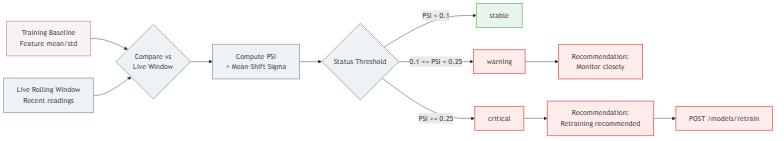

Real example, `reports/drift_status.json`:
```json
{
  "baseline_mean": 0.0, "live_mean": 0.0,
  "mean_shift_sigma": -4.71, "psi": 16.57,
  "affected_features": ["lag_1", "roll_std_15", "..."],
  "status": "critical",
  "recommendation": "Retraining recommended"
}
```

Covered by `tests/test_drift.py`.

---

## 17. Retraining Workflow

`src/retraining/retrain_pipeline.py::run_retraining`, triggered by
`POST /models/retrain` (runs in a background thread so the request
returns immediately).

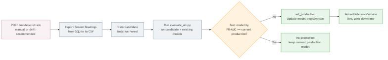

Steps: export the most recent 10,000 readings from SQLite back into the
processed-CSV shape → retrain Isolation Forest as a candidate → run the
*same* `evaluate_all.py` used for the original model comparison → compare
the new best-by-PR-AUC model against the current production model → if
different, call `set_production()` and reload the live `InferenceService`
in-place.

**A note on this specific pipeline, found and fixed during this project's
cleanup pass:** as of a recent audit, this code called two functions that
did not exist in their target modules (`load_registry()` and
`get_inference_service()`), which meant the promotion step would raise an
`ImportError` the first time a retraining run actually found a better
model. This has since been corrected to use the real registry API
(`list_models()`, `set_production()`) and the real running
`inference_service` singleton from `src.api.main`. It is documented here
because it is exactly the kind of "looks done, was never exercised"
failure mode this report is trying not to repeat elsewhere.

**Also note:** the README previously documented a
`POST /retraining/promote/{model_id}` endpoint. **This endpoint does not
exist.** Promotion happens automatically, inside `run_retraining()` itself,
by directly calling the registry — there is no separate manual "promote"
HTTP call in the retraining flow (manual hot-swapping of any model,
independent of retraining, is `POST /models/select/{name}`, §12).

No dedicated `test_retraining.py` exists yet.

---

## 18. Synthetic Fault Injection

`src/synthetic/fault_generator.py`, `fault_injector.py`,
`synthetic_stream.py`, exposed via `POST /faults/inject`,
`GET /faults/status`, `POST /faults/stop`. Real, implemented fault types
(`FAULT_TYPES` in `fault_generator.py`):

```
spike | gradual_drift | sensor_stuck | missing_values | noise_burst
```

**Note:** `src/api/schemas.py` declares two additional values in its own
`FAULT_TYPES` list — `overheating` and `vibration_fault` — that do not
appear in `fault_generator.py`'s implementation. This report does not
claim those two are functional; they are declared in the request schema
but their generator-level behavior was not verified.

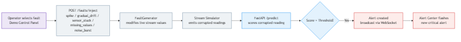

```json
POST /faults/inject
{ "fault_type": "spike", "duration_steps": 10, "magnitude": 40.0, "sensor_id": "machine_temperature" }
```

Used by the Demo Control Panel frontend page to trigger a live, visible
anomaly during a demo without waiting for a natural one. Covered by
`tests/test_fault_injection.py`.

---

## 19. Incident Report PDF Export

`src/reports/incident_report.py`, exposed via
`GET /reports/incident/{alert_id}`. Generates a binary PDF (ReportLab) for
a resolved alert, embedding the alert's readings context as a matplotlib
chart plus the operator's notes and resolution timestamp. Covered by
`tests/test_incident_report.py`. This is genuinely implemented, not a
stub — the test asserts a real PDF byte stream is returned.

---

## 20. Frontend Platform

React 19 + TypeScript + Vite 8 + TailwindCSS + TanStack Query + Recharts +
framer-motion. All 12 pages are wired in `frontend/src/App.tsx` behind a
shared `AppShell` (sidebar + status bar):

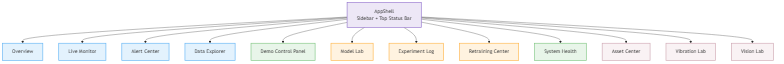

| Page | Purpose |
|---|---|
| Overview | System-wide operational summary |
| Live Monitor | Real-time chart of raw value + anomaly score via WebSocket |
| Alert Center | View/acknowledge/investigate/resolve alerts, give feedback |
| Data Explorer | Browse historical readings |
| Demo Control Panel | Trigger synthetic faults (§18) |
| Model Lab | Compare all 7 models' metrics |
| Experiment Log | Training run history (`reports/experiments.json`) |
| Retraining Center | Trigger retraining, hot-swap production model |
| System Health | Drift status (§16) |
| Asset Center | Cross-modality asset list (§25) |
| Vibration Lab | Live vibration health (§23) |
| Vision Lab | Image upload + anomaly analysis (§24) |

**Honesty note on a few specific claims:** the Vibration Lab, Vision Lab,
and Asset Center pages call their backend endpoints with inline
`fetch`/`WebSocket` calls using a hardcoded `http://localhost:8000` /
`ws://localhost:8000`, rather than through the shared, env-configured
`src/lib/api.ts` client the other pages use. This means those three pages
will not work against a non-default backend host without a code change,
even though the app does have a working `VITE_API_URL`/`VITE_WS_URL`
mechanism that the other 9 pages correctly use. This is a real, current
limitation, not fixed as part of this report.

No claim of "50 FPS" or any other specific measured frame rate is made in
this report — the live chart's actual rendering rate has not been
benchmarked, and repeating an unverified number here would violate this
report's own standard.

---

## 21. Database Design

SQLite via SQLAlchemy, `src/database/database.py`. Four tables — verified
directly from the model definitions, not from an earlier (less accurate)
diagram:

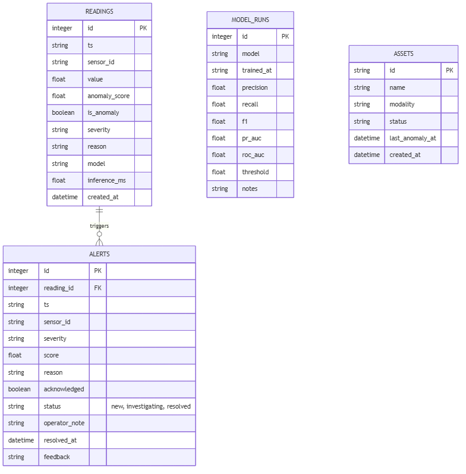

- **`Reading`** — every ingested sensor value plus its computed score,
  `is_anomaly` flag, severity, reason, and which model scored it.
- **`Alert`** — one row per threshold breach, foreign-keyed to the
  triggering `Reading`; carries the real `status` values described in
  §15, `acknowledged` (boolean), `operator_note`, `resolved_at`, and
  `feedback`.
- **`ModelRun`** — a lightweight table for logging model runs
  (`precision`, `recall`, `f1`, `pr_auc`, `roc_auc`, `threshold`,
  `notes`) — distinct from, and simpler than, `model_registry.json`.
- **`Asset`** — one row per monitored physical asset across modalities
  (pre-seeded with `Machine-01` / time-series, `Bearing-01` / vibration,
  `Product-Inspection-01` / vision), backing the Asset Center (§25).

There is no `retraining_runs` table in the codebase — an earlier planning
document referenced one; it was never built, and this report does not
claim it exists.

---

## 22. Backend API Documentation

**Implemented and verified** (file:line references from `src/api/main.py`
unless noted):

| Method | Path | Purpose |
|---|---|---|
| GET | `/health` | Liveness check |
| POST | `/predict` | Primary single-reading ingestion |
| POST | `/predict/batch` | Batch ingestion |
| POST | `/predict/ensemble` | Score a reading against all registered models at once |
| GET | `/alerts` | List alerts |
| PUT | `/alerts/{id}/ack` | Acknowledge |
| PUT | `/alerts/{id}/status` | Change lifecycle status (§15) |
| PUT | `/alerts/{id}/feedback` | Record true/false positive feedback |
| PUT | `/alerts/{id}/replay` | Replay an alert's context |
| GET | `/reports/incident/{alert_id}` | PDF incident report (§19) |
| GET | `/models`, `/models/registry`, `/models/comparison` | Registry reads |
| POST | `/models/select/{name}` | Hot-swap production model |
| POST | `/models/retrain` | Trigger retraining (§17) |
| GET | `/drift/status`, `/drift/check`, `/drift/history` | Drift monitoring (§16) |
| POST | `/faults/inject`, `/faults/stop`; GET | `/faults/status`, `/faults/types` | Fault injection (§18) |
| GET | `/experiments` | Experiment history |
| GET | `/data/summary`, `/system/status`, `/metrics`, `/readings` | Misc. system/data reads |
| WS | `/ws/stream` | Live telemetry + alert broadcast |
| — (via `include_router`) | `/vibration/*` | Vibration module (§23) |
| — (via `include_router`) | `/image/*` | Vision module (§24) |
| — (via `include_router`) | `/assets/*` | Asset Center (§25) |

**Documented previously but does not exist:** `POST /retraining/promote/{model_id}`
— see §17 for what actually happens instead.

**Example — `POST /predict` request/response:**
```json
// Request
{ "sensor_id": "machine_temperature", "timestamp": "2026-07-06T14:32:01.000Z", "value": 85.4 }

// Response
{
  "timestamp": "2026-07-06T14:32:01.000Z", "sensor_id": "machine_temperature",
  "value": 85.4, "anomaly_score": 0.61, "is_anomaly": true,
  "severity": "high", "reason": "'roll_std_15' is 12.4 std devs from baseline (2.100 vs normal 0.180). Rec: inspect cooling / thermal sensors.",
  "model": "isolation_forest", "inference_ms": 0.71
}
```

---

## 23. Vibration Module

**Status: ✅ Implemented** (this was scoped as a stretch/roadmap item in
earlier planning documents; it has since been built and is functionally
verified end to end — not merely planned).

Pipeline: `src/vibration/data_loader.py` (loads NASA Bearing snapshot
files) → `src/vibration/features.py` (time + frequency features, below) →
`src/vibration/train.py` (Isolation Forest on the first 400 of ~984
snapshots, treated as the "healthy" period before the known Test-2
failure) → `models/vibration_iforest.pkl` + `models/vibration_scaler.pkl` →
`src/api/vibration_router.py` (serves `/vibration/sample`,
`/vibration/ws/stream`) → `frontend/src/pages/VibrationLab.tsx`.

**Time-domain features:**
```
RMS       = sqrt( (1/N) · Σ x_i² )              — signal energy
Peak      = max(|x_i|)
Crest Factor = Peak / (RMS + ε)                  — impulsiveness indicator
Kurtosis, Skewness, Variance                     — distribution shape
```
RMS is the standard vibration-severity indicator in condition monitoring:
a healthy bearing's vibration energy is low and stable; energy rises as
damage develops.

**Frequency-domain features (FFT):** the real-valued FFT
(`scipy.fft.rfft`) decomposes the raw time-domain signal into its
constituent frequency components. From the resulting power spectrum, the
code extracts the **dominant frequency** (the frequency bin with the most
energy), the **spectral centroid** (the energy-weighted "center of mass"
frequency — shifts as new fault frequencies appear), and **spectral
entropy** (a measure of how concentrated vs. spread-out the spectrum is —
a pure tone has low entropy, broadband noise has high entropy). This
matters for bearings specifically because different fault types (inner
race, outer race, ball) produce energy at characteristic, physically
predictable frequencies — FFT is how you'd actually see that in
practice, though this project does not yet map specific frequency bins to
specific fault diagnoses.

**Limitations:** trained and evaluated on a single bearing test run (Test
2, bearing index 0); no held-out evaluation metrics comparable to §9's
table exist for this module (only `min_score`/`max_score` diagnostics in
the registry entry); no dedicated pytest file.

---

## 24. Visual Inspection (Image) Module

**Status: ✅ Implemented**, with the dataset correction noted in §6.

Pipeline: `src/image/embeddings.py` (`ResnetEmbeddingExtractor`) → 512-dim
embeddings → `src/image/train.py` (Isolation Forest on "good"-only
training embeddings) → `models/vision_iforest.pkl` →
`src/api/image_router.py` (serves `/image/gallery`, `/image/analyze`) →
`frontend/src/pages/VisionLab.tsx`.

**Correction to prior documentation:** the embedder is
**ResNet18** (`torchvision.models.resnet18`, ImageNet-pretrained, final
classification layer replaced with `nn.Identity()` to expose the raw
512-dimensional feature vector) — **not ResNet50** as earlier project
documentation stated.

**Why embeddings + Isolation Forest, not a deep anomaly-specific
architecture:** this is a standard, effective pattern for visual anomaly
detection with very little labeled defect data — a pretrained CNN's
embedding space already separates "normal-looking" images from unusual
ones reasonably well without ever training on defects directly (the
Isolation Forest is fit **only** on "good" training images), so no defect
labels are required for training, only for evaluation.

Real registry metrics
(`models/model_registry.json`, `name: "vision_iforest"`):
```json
{ "train_samples": 3291, "good_mean_score": 0.209, "defect_mean_score": 0.186, "threshold": 0.198 }
```
The gap between `good_mean_score` and `defect_mean_score` (0.209 vs.
0.186) is real but modest — this is a working proof of concept, not a
tuned production-grade defect detector, and there is no windowed/PR-AUC
style evaluation table for this module comparable to §9.

**Limitations:** no dedicated pytest file; dataset is a real
casting-defect set, not MVTec AD; no per-defect-type breakdown of
accuracy.

---

## 25. Multi-Modal Asset Center

**Status: ✅ Implemented.** `src/api/asset_router.py` (`/assets/*`) reads
the `Asset` table (§21), which is pre-seeded with one asset per modality
(`Machine-01` / time-series, `Bearing-01` / vibration,
`Product-Inspection-01` / vision) and surfaces their status
(`operational`/`warning`) and last-anomaly timestamp in one unified list —
`frontend/src/pages/AssetCenter.tsx`. This is a real, working cross-modal
view, not a mockup — it queries the actual database — but it currently has
no dedicated pytest coverage and (like the Vibration/Vision Lab pages)
calls its endpoint with a hardcoded URL rather than through the shared API
client (§20).

---

## 26. Testing and Quality Assurance

`pytest -q` from the repo root; `pyproject.toml` sets
`pythonpath = ["."]` and `testpaths = ["tests"]`. 33 tests across 11 files:

| File | Covers |
|---|---|
| `test_preprocessing.py` | §7 |
| `test_features.py` | §8 |
| `test_leakage.py` | Asserts no future-data leakage in features/splits |
| `test_model.py` | Inference service, explanation text |
| `test_stream.py` | §14 |
| `test_database.py` | §21 (in-memory SQLite) |
| `test_api.py` | `/health`, `/predict` only |
| `test_drift.py` | §16 |
| `test_fault_injection.py` | §18 |
| `test_incident_report.py` | §19 |
| `test_alert_lifecycle.py` | §15 |

**Not covered by any dedicated test file:** vibration module, vision
module, Asset Center, model registry, retraining pipeline, and most of the
JSON-reading endpoints in §22 beyond `/health`/`/predict`.

**A concrete bug that was found and fixed in this same codebase, worth
recording as evidence this testing gap is real:** `test_alert_lifecycle.py`
and `test_api.py` both assigned `app.dependency_overrides[get_db]` on the
same shared FastAPI `app` object at *import time*. Since pytest imports
every test module before running any test, whichever file was collected
last silently won for the rest of the session — meaning
`test_alert_lifecycle.py` passed in isolation but failed the moment the
full suite ran together. This was fixed by re-asserting (and restoring)
the override inside a per-test fixture rather than at import time. It is
exactly the class of bug that "tests pass in isolation" hides and a
missing-coverage report cannot catch on its own.

**Frontend:** `cd frontend && npm run build` (TypeScript project build +
Vite bundle) — currently passes. No frontend unit/component test suite
exists (no Jest/Vitest/Testing Library configuration found).

**Infrastructure:** `docker compose config` validates the compose file
syntax; it does not itself prove the containers run correctly together
(that would require `docker compose up --build` plus a manual or scripted
smoke test).

---

## 27. Deployment

**Docker Compose** (`docker-compose.yml`) — two services:

- `api` — builds `docker/Dockerfile`, runs
  `uvicorn src.api.main:app --host 0.0.0.0 --port 8000`, bind-mounts
  `models/`, `reports/`, `data/`, and reads `DB_URL`, `RAW_CSV`,
  `PROCESSED_CSV`, `MODEL_DIR`, `SENSOR_ID` from environment.
- `frontend` — builds `frontend/Dockerfile`, serves on port 3000,
  `depends_on: api`.

```bash
docker compose up --build
```

**Local (no Docker):**
```bash
python -m venv .venv
.venv\Scripts\activate            # Windows
pip install -r requirements.txt
python -m uvicorn src.api.main:app --host 0.0.0.0 --port 8000 --reload

cd frontend && npm install && npm run dev

python -m src.streaming.stream_simulator --speed 50 --loop
```

---

## 28. Demo Scenario

1. Start the API, frontend, and stream simulator (§27).
2. Open the frontend, navigate to **Live Monitor** — observe the raw
   value trace and anomaly score sitting below threshold.
3. Go to **Demo Control Panel**, click **Inject Spike Fault**
   (`POST /faults/inject`, `fault_type: "spike"`).
4. Watch the Live Monitor anomaly score spike; a new alert appears in
   **Alert Center**.
5. Open the alert, set status to `investigating`, add an operator note,
   set status to `resolved`.
6. Download its incident report PDF (`GET /reports/incident/{id}`).
7. Visit **System Health** to see the drift metric shift from the
   injected fault.
8. Visit **Retraining Center**, trigger `POST /models/retrain`, observe
   the run appear in **Experiment Log**.

---

## 29. Results and Discussion

The production model (Isolation Forest) achieves F1 = 0.947 with
sub-hundredth-of-a-millisecond inference — a strong, genuinely evaluated
result for a rare-event, unsupervised setting. The LSTM Autoencoder scores
higher on F1 (0.992) and, once its evaluation-script sign bug (§9) is
accounted for, on ROC-AUC too — it is the more accurate model, but roughly
2.6× slower per prediction, which is the documented reason it is not the
default.

The weakest models (River HST, F1 = 0.047; Rolling Z-score baseline,
F1 = 0.212) are *intentionally* included and reported honestly: the
Z-score baseline exists specifically to prove the more sophisticated
models are earning their complexity, and River's poor showing here is a
genuine, unflattering result for its specific configuration on this
dataset, not smoothed over.

The False Alarm Rate spread (0.02 for Isolation Forest vs. 0.9997 for
Elliptic Envelope — see `false_alarm_rate_comparison.png`) is the clearest
illustration in this project of why model selection for anomaly detection
cannot be F1-alone: Elliptic Envelope's F1 (0.259) looks merely "poor," but
a 99.97% false alarm rate means it is, in practice, unusable in a real
control room.

---

## 30. Limitations

- Primary dataset is univariate (temperature only); no multivariate
  correlation modeling across sensor channels.
- The "live" feed is a historical-data replay (§14), not a true
  MQTT/Kafka pub-sub ingestion path.
- SQLite is used for all persistence; concurrent high-frequency writes
  under real production load would need a dedicated time-series database.
- Models were pickled with scikit-learn 1.7.2; `requirements.txt` pins
  1.5.1 — every model load currently emits an
  `InconsistentVersionWarning`, a real reproducibility gap between the
  committed artifacts and the committed dependency pin.
- LSTM Autoencoder's committed ROC-AUC/PR-AUC are unreliable due to the
  sign bug documented in §9 — use F1/Precision/Recall for this model until
  fixed.
- Vibration, vision, Asset Center, model registry, and retraining have no
  dedicated automated test coverage.
- Three frontend pages (Vibration Lab, Vision Lab, Asset Center) call
  their backend with a hardcoded `localhost:8000` URL instead of the
  shared, environment-configured API client used elsewhere.
- The vision module's committed dataset is a real casting-defect image
  set, not MVTec AD as earlier documentation claimed; its embedder is
  ResNet18, not ResNet50.
- Vibration and vision modules report only diagnostic score ranges, not a
  Precision/Recall/F1/PR-AUC table comparable to §9.

---

## 31. Future Work

Realistic next steps, distinguished from work already done:

- Fix the LSTM ROC-AUC/PR-AUC sign bug in `evaluate_all.py` and
  regenerate `evaluation_results.csv`.
- Add dedicated test coverage for vibration, vision, asset, registry, and
  retraining endpoints.
- Route the three hardcoded-URL frontend pages through the shared
  `src/lib/api.ts` client.
- Re-pin `requirements.txt` to the scikit-learn version the committed
  models were actually trained with, or retrain under the pinned version.
- Migrate SQLite to PostgreSQL/TimescaleDB for concurrent-write headroom.
- Replace the historical-replay stream simulator with a real MQTT/Kafka
  ingestion path.
- Build a genuine held-out evaluation table for the vibration and vision
  modalities, comparable in rigor to §9's table.
- Multivariate correlation modeling (temperature + pressure + vibration
  jointly) once a suitable dataset is available.

---

## 32. Conclusion

This platform demonstrates a complete, evaluated, and largely honest
MLOps loop for industrial anomaly detection: real data in, causal feature
engineering, seven independently trained and fairly compared models, a
served production model with a live alert lifecycle, and two working
extensions into other sensor modalities. Its greatest strength is that
almost every number in this report is traceable to a specific file the
reader can open and re-run. Its most important limitation, documented
throughout rather than hidden, is that several of its newer components
(vibration, vision, registry, retraining) are functionally real but not
yet load-bearing in the sense of having their own test suite — the
difference between "it worked when I last ran it" and "there's a test
that would tell me if it broke."

---

## 33. Appendices

### A. Real commands used throughout this report

```bash
# Train all classical models + baseline
python -m src.models.train_baseline
python -m src.models.train_isolation_forest
python -m src.models.train_one_class_svm
python -m src.models.train_lof
python -m src.models.train_elliptic_envelope
python -m src.models.train_lstm_autoencoder
python -m src.models.train_river_online

# The one true evaluation table
python -m src.models.evaluate_all

# Vibration / vision training
python -m src.vibration.train
python -m src.image.train

# Tests
pytest -q
python -m pytest

# Frontend
cd frontend && npm run build

# Infra
docker compose config
docker compose up --build

# This report's figures
python scripts/generate_report_figures.py
python scripts/generate_diagrams.py
```

### B. Figure index

See `docs/final_report/figures/FIGURES_INDEX.md` for the complete list of
figures, their exact source data, and generation method (Mermaid diagram
vs. real-data matplotlib chart) for every image referenced in this report.

### C. Full model registry

See `models/model_registry.json` (committed to git — the only model
artifact that is) for the complete, current registry entry for every
trained model across all three modalities.

### D. Related documents

- `PROJECT_SCAN_AND_CLEANUP_PLAN.md` — the audit that surfaced most of the
  corrections documented in this report.
- `docs/PROJECT_STRUCTURE.md` — folder-by-folder repository guide.
- `MASTER_ROADMAP_MULTIMODAL_PLATFORM.md` — the current master planning
  document (historical planning docs superseding it are archived in
  `docs/archive/`).
