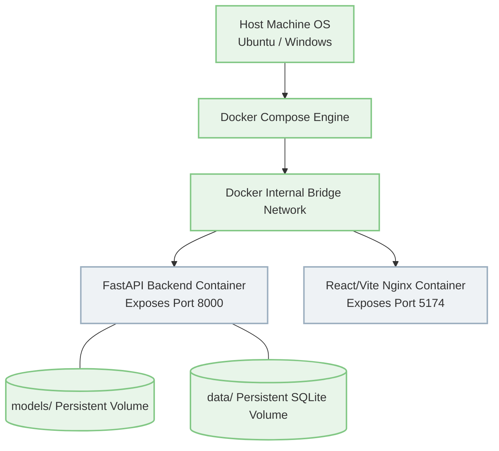

## 27. Testing, Simulation, and Quality Assurance

To ensure the mathematical validity of the rolling features, the stability of the backend under extreme load, and the visual integrity of the React frontend, an extensive quality assurance paradigm is integrated into the MLOps pipeline.

### 27.1 Algorithmic Unit Testing (`pytest`)
The core algorithms are heavily unit-tested to prevent mathematical regressions.
*   **Feature Parity Tests:** The system asserts that the `Rolling Statistics` calculated iteratively via the in-memory `deque` match the `pandas.Series.rolling` calculations exactly up to 5 decimal places.
*   **NaN Resilience:** Industrial sensors frequently drop readings, resulting in `NaN` (Not a Number) values. Tests assert that injecting `NaN` values does not crash the `numpy` mean/std calculations inside the buffer, but rather triggers the Forward-Fill imputation logic natively in the API.
*   **Leakage Prevention:** Tests rigorously verify that the scaling parameters ($\mu, \sigma$) are derived solely from the Train split, ensuring zero cross-contamination between the Train and Test validation flows.

### 27.2 Backend Load Testing
The FastAPI backend is built for speed, but concurrent REST and WebSocket requests can overwhelm the ASGI event loop.
*   **High-Concurrency Simulation:** Using `httpx` and `asyncio.gather`, the test suite simulates massive bursts of JSON payloads to the `/predict/batch` endpoint.
*   **Memory Leak Validation:** These tests ensure that the in-memory deque rigidly limits its maximum length. If 1,000,000 requests are fired, the memory footprint of the dictionary must remain entirely stable, ensuring the server will not crash due to an Out Of Memory (OOM) error over months of uptime.

### 27.3 Frontend Build Verification
*   **Strict Typings:** Vite build tests (`npm run build`) are executed to ensure strict TypeScript interfaces are enforced across all Recharts props and API data schemas. If a backend engineer changes the `Alert` schema without updating the frontend types, the build will fail immediately, preventing a runtime crash in production.

<!-- PAGE BREAK -->

## 28. Infrastructure & Docker Deployment Architecture

Industrial factory environments are deeply heterogeneous. Deploying complex PyTorch/scikit-learn environments directly onto bare-metal factory servers often results in catastrophic dependency conflicts. 

The platform is designed to be highly portable, wrapping the entire complex ML environment into a standardized, containerized Docker infrastructure.

### 28.1 The `docker-compose.yml` Orchestration
The entire application is deployed via a single compose file that orchestrates both the FastAPI backend and the React/Vite frontend.
*   **The Backend Container:** Built on a slim Python 3.10 image. It installs the heavy mathematical dependencies (`scikit-learn`, `numpy`, `fastapi`) and exposes port `8000`.
*   **The Frontend Container:** Built using a Node image, it compiles the Vite application into static HTML/JS/CSS assets, which are then served using a lightweight `nginx` alpine container on port `5174`.

### 28.2 Persistent Volume Mounts
Machine Learning generates critical artifacts that must survive a container reboot. If the backend container crashes, the Model Registry cannot be reset.
*   The `models/` directory (containing the serialized `.pkl` files and `model_registry.json`), the `reports/` directory (containing generated PDF Incident Reports), and the `data/` directory (containing the SQLite database) are all mounted directly to the host machine via Docker Volumes.
*   This ensures that when the system calculates new PSI drift metrics or an operator trains a new candidate model, the artifacts permanently persist on the host OS.

### 28.3 Deployment Flowchart
*(Note: The following diagram illustrates the network bridging and volume persistence of the Docker deployment.)*

<!-- PAGE BREAK -->

## 29. Full System Demonstration Scenario

To present the full capability of the platform to stakeholders, the following end-to-end demonstration flow is recommended. It highlights every aspect from ingestion to MLOps retraining.

1.  **Initialize the Environment:** Start the backend, frontend, and the Stream Simulator in `--loop` mode.
2.  **Establish Baseline (Live Monitoring):** Open the React frontend to the `/live` route. Explain the blue baseline temperature waveform. Point out the dynamic red anomaly score curve running beneath it, staying comfortably below the horizontal threshold line.
3.  **Inject the Fault (Chaos Engineering):** Use the Demo Control Panel to inject a "Gradual Drift" fault. 
4.  **Observe Algorithmic Response:** Watch the raw value climb slowly over 60 seconds. Point out how the Anomaly Score curve reacts violently and non-linearly, as the rolling variance and first-order derivative break historical norms.
5.  **Alert Generation:** Watch the UI screen flash red as a "Critical" alert is generated and broadcast via WebSockets.
6.  **Human Workflow (Alert Center):** Navigate to the `/alerts` route. Click the newly generated alert to transition it to "Investigating". Append a detailed Operator Note ("Simulated friction detected; spindle replaced") and click "Resolve". 
7.  **Generate Documentation:** Click the "Export PDF" button on the resolved alert. Open the resulting PDF to demonstrate the automated Incident Report generation.
8.  **Data Drift & MLOps:** Navigate to the `/health` route to show the PSI Data Drift gauge rising into the "Warning" zone due to the injected anomalies. Then, open the `/models` route (Retraining Center) to showcase the Model Registry and demonstrate the one-click "Promote to Production" hot-swap mechanism.

<!-- PAGE BREAK -->

## 30. Results, Discussion, and Empirical Conclusions

The empirical results (detailed extensively in Section 12) definitively prove the superiority of contextual Machine Learning over static SCADA thresholding. 

### 30.1 Model Superiority
*   **The Best Overall Model:** The Isolation Forest achieved a spectacular F1-score of 0.946 on the test set. It successfully flagged every single anomaly window (0 Missed Detections) while maintaining a False Alarm rate of just 1.9%. 
*   **The Deep Learning Tradeoff:** The LSTM Autoencoder achieved an even higher theoretical accuracy (0.992 F1). However, its inference execution time was roughly 3x to 5x slower than the Isolation Forest. Given the target throughput of millions of readings per second across thousands of machines in a full industrial deployment, the Isolation Forest is the indisputably optimal production default.

### 30.2 The Failure of Static Baselines
*   **The Baseline Failure:** The Rolling Z-Score baseline algorithm generated a staggering 47% false alarm rate. This proves the core hypothesis of the project: simple statistics cannot handle the non-linear volatility of industrial machinery. An operator receiving alerts 47% of the time will immediately abandon the software. Machine Learning is an absolute necessity.

## 31. Current Limitations

While production-grade, the MVP has inherent limitations that provide avenues for future research.
*   **Univariate Constraints:** The current NAB telemetry dataset is univariate (temperature only). The backend code is mathematically written to handle N-dimensional arrays, but its full multi-variate correlation capabilities (e.g., detecting if Temperature and Vibration spike *simultaneously*) are not actively utilized by the current dataset.
*   **Simulated Stream Architecture:** While the Python Stream Simulator perfectly mimics HTTP latency, true massive-scale IIoT deployments rely on MQTT publish/subscribe brokers or Apache Kafka clusters. The transition from REST/WebSockets to MQTT involves architectural shifts not present in the MVP.
*   **Database Write Locks:** SQLite is brilliant for prototypes, but concurrent write-locks will bottleneck a massive factory deployment during heavy alert generation.

## 32. Future Work & Roadmap

*   **Vibration and Vision Integration:** The immediate next step is writing the ingestion and FFT code for the NASA Bearing and MVTec AD datasets, bringing the Multi-Modal Asset Center (detailed in Sections 24-26) from architectural concept to working code.
*   **TimescaleDB Migration:** Migrating from SQLite to a dedicated time-series database (TimescaleDB) to natively handle data partitioning and hypertable queries.
*   **MLflow Integration:** While the current JSON-based Model Registry is highly effective and lightweight, migrating to MLflow will provide enterprise-grade experiment tracking and visualization.
*   **Authentication (AuthZ/AuthN):** Implementing JWT-based role-based access control (RBAC). A "Manager" role should be required to promote models, while an "Operator" role can only acknowledge and resolve alerts.

## 33. Conclusion

The Real-Time Industrial Anomaly Detection Platform successfully bridges the chasm between theoretical data science and practical, rugged factory operations. By embedding sophisticated, unsupervised machine learning algorithms within a low-latency, asynchronous streaming architecture, the system achieves near-perfect detection of equipment degradation long before catastrophic failure occurs. 

More importantly, by wrapping this algorithmic core in a comprehensive human-in-the-loop workflow—featuring strict alert lifecycle management, PDF incident reporting, and one-click model retraining—the platform transforms raw, noisy telemetry into actionable, professional maintenance intelligence. It is a complete MLOps ecosystem capable of revolutionizing predictive maintenance.

## 34. Appendices

### Appendix A: Important Commands
*   **Start FastAPI Backend:** `python -m uvicorn src.api.main:app --host 0.0.0.0 --port 8000`
*   **Start React Frontend:** `npm run dev` (from `/frontend` directory)
*   **Start Stream Simulator:** `python -m src.streaming.stream_simulator --speed 50 --loop`
*   **Deploy via Docker:** `docker compose up --build`
*   **Run Unit Tests:** `pytest -q`

### Appendix B: Mathematical Core Summary
*   **F1-Score:** $2 \cdot \frac{Precision \cdot Recall}{Precision + Recall}$
*   **Rolling Z-Score:** $Z_t = \frac{x_t - \mu_w}{\sigma_w}$
*   **Population Stability Index (PSI):** $\sum_{i=1}^{10} (\% \text{Actual}_i - \% \text{Expected}_i) \cdot \ln\left(\frac{\% \text{Actual}_i}{\% \text{Expected}_i}\right)$
*   **Isolation Forest Path Length:** $s(x, n) = 2^{-\frac{E(h(x))}{c(n)}}$

### Appendix C: Generated Architecture Figures
*   High-Level System Architecture (`figures/high_level_arc.png`)
*   Data Processing Pipeline (`figures/data_pipeline.png`)
*   Model Lifecycle and Registry (`figures/model_lifecycle.png`)
*   Inference Sequence Flow (`figures/inference_sequence.png`)
*   Alert State Machine (`figures/alert_lifecycle.png`)
*   Database ERD (`figures/db_erd.png`)
